# Canvas によるノーコード体験（追加ラボ）

> 本ドキュメントは [手順書.md](./手順書.md) の追加ラボです。時間が余った場合に実施してください。プロコード経路（[手順書.md](./手順書.md) セクション 2〜3）を優先し、これは最後に取り組む前提です。
>
> ℹ️ 目安時間: 15〜20 分（講師デモ）

## このラボの位置づけ

[手順書.md](./手順書.md) の「2. 学習とデプロイ」で構築したプロコード（XGBoost、`ModelTrainer`/`ModelBuilder`）のモデルと、**同じデータ・同じタスク**（風向・風速から有義波波高を推定する回帰）を、SageMaker Canvas でコードを書かずに構築します。最後に両方の精度・特徴量重要度を見比べます。

> ℹ️ **SageMaker Canvas とは**: コードを書かずに GUI 操作だけでデータ準備・モデル構築・デプロイができる SageMaker のノーコードツールです。内部では **AutoML**（複数のアルゴリズム・ハイパーパラメータ設定を自動的に試し、最も精度が良いモデルを選び出す仕組み）が使われており、プロコード側で行った「アルゴリズムを選ぶ」「ハイパーパラメータを設定する」といった作業を自動化してくれます。
>
> ℹ️ **AutoML の学習は講師が事前に実行しておきます。** Canvas の Standard build は 30〜45 分かかるため、当日その場で待つ余裕がありません。当日はデータ取り込み〜列削除の操作を実演し、その後に事前実行済みの結果画面を開きます。

## 1. Canvas によるデータ準備

### 1.1 データセットについて

東京港の海象観測データ（擬似データ、実データの統計的性質を再現したもの）を使い、風向・風速から有義波波高を推定するタスクに取り組みます。データセットは CSV 化のみを行った状態（欠測はそのまま残す、風向は文字列のまま、未使用列も含む）で用意されています。

データセットの列一覧

| 列名 | 説明 |
|---|---|
| timestamp | 観測時刻 |
| wave_height_max | 最高波波高（m） |
| wave_period_max | 最高波周期（s） |
| wave_height | 有義波波高（m）— **目的変数** |
| wave_period | 有義波周期（s） |
| wave_dir | 波向（16 方位） |
| current_dir | 流向（16 方位） |
| current_speed | 流速（cm/s） |
| wind_dir | 風向（16 方位）— 特徴量 |
| wind_speed | 風速（m/s）— 特徴量 |
| tide_level | 潮位（cm） |

### 1.2 データセットを取得する

Canvas 用のサンプル CSV（`canvas_dataset.csv`）は、[手順書.md](./手順書.md) の「1.5 ノートブック・スクリプトを取得する」で `git clone` したリポジトリの `notebook/canvas_dataset.csv` に含まれています。既にリポジトリを取得済みであれば、追加のダウンロードは不要です。

> ℹ️ **このファイルの作り方**: `canvas_dataset.csv` は、プロコード側で使っている `generate_synthetic_data.py`（東京港の実データの統計的性質を再現する擬似データ生成スクリプト）を、列を絞らずそのまま実行して出力したものです。プロコード側の学習データ（`observation.csv`）と生成ロジックは同じで、出力される列もすべて同じです。実データ（東京都港湾局が公開）は利用条件の確認が必要なため配布できませんが、この擬似データは自作の合成データなので、配布・加工・公開のいずれも自由に行えます。

Canvas は S3 上のデータを直接読み込めるため、`canvas_dataset.csv` を S3 にアップロードしておきます。この作業用に専用のノートブック **`notebook/canvas_prepare_dataset.ipynb`** を用意しています。JupyterLab でこのノートブックを開き、上から順にセルを実行してください。

このノートブックは次の処理を行います。

1. S3 バケット・アップロード用クライアントの準備
2. `canvas_dataset.csv` が手元に無ければ `generate_synthetic_data.py` で生成（あればスキップ）
3. データ内容の確認（全 11 列・約 43,800 行）
4. `canvas_dataset.csv` を S3 にアップロードし、`s3://...` のパスを表示

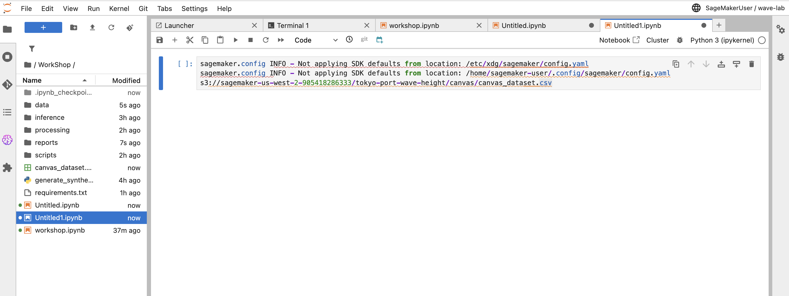

最後のセルで表示された `s3://...` のパス（例: `s3://sagemaker-<リージョン>-<アカウント ID>/tokyo-port-wave-height/canvas/canvas_dataset.csv`）を確認しておきます。次の手順で、このパスと同じバケット・フォルダを Canvas 側からたどります。

> ℹ️ **バケット名は各自で異なります**。上記の `sagemaker-<リージョン>-<アカウント ID>` は SageMaker が自動作成する既定バケットで、アカウント ID の部分は参加者ごとに違います。次の手順では Canvas の画面上で自分のバケットをたどって選びます（フォルダ構造 `tokyo-port-wave-height/canvas/canvas_dataset.csv` は全員共通）。

### 1.3 Canvas を起動して開く

SageMaker Studio の **Applications** メニューから **Canvas** を選択します。Canvas アプリケーションが停止している場合は、まず **Run** を選択して起動する必要があります。

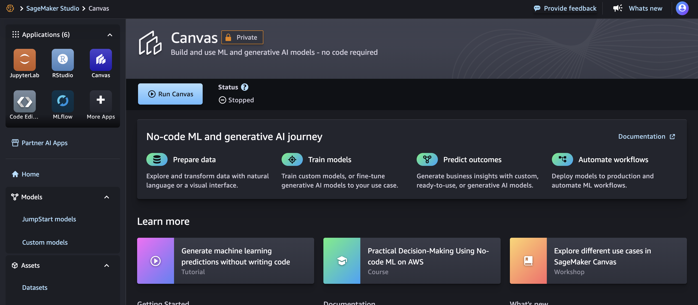

起動には数分かかります。状態が **Running** に変わると、**Open Canvas** が選択できるようになります。

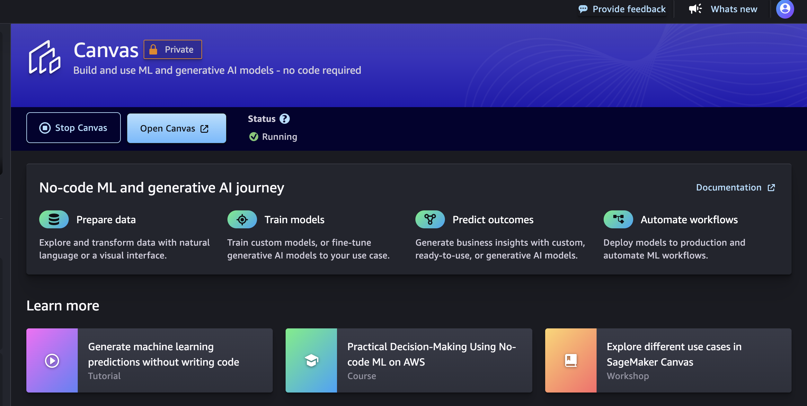

**Open Canvas** を選択すると、Canvas のホームページが新しいタブで開きます。

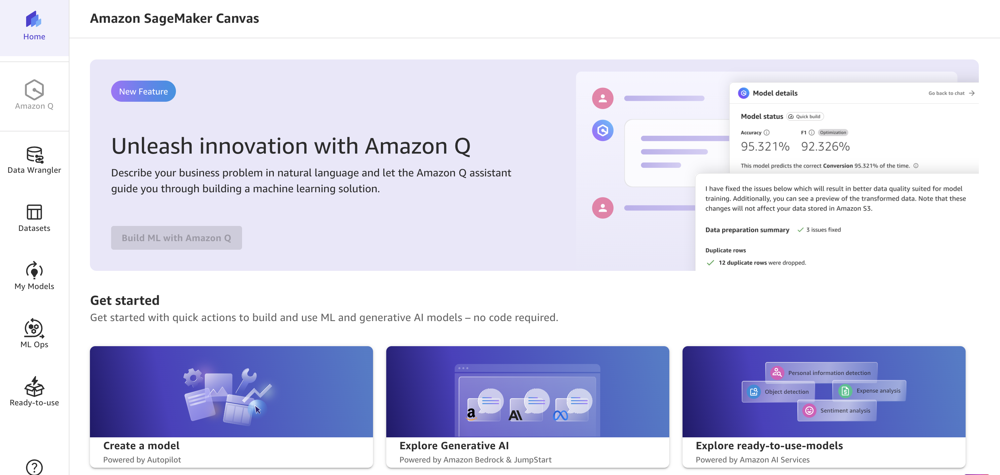

### 1.4 Canvas でデータを読み込む

Canvas のホームページで、左ナビゲーションの **Data Wrangler** を選択します。

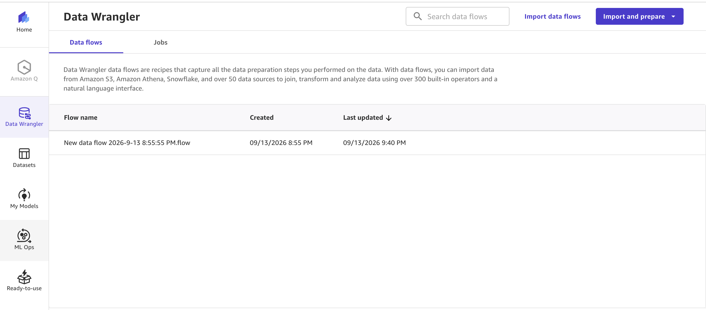

**Import data**（または **Import and prepare**）をクリック → **Tabular** を選択します。

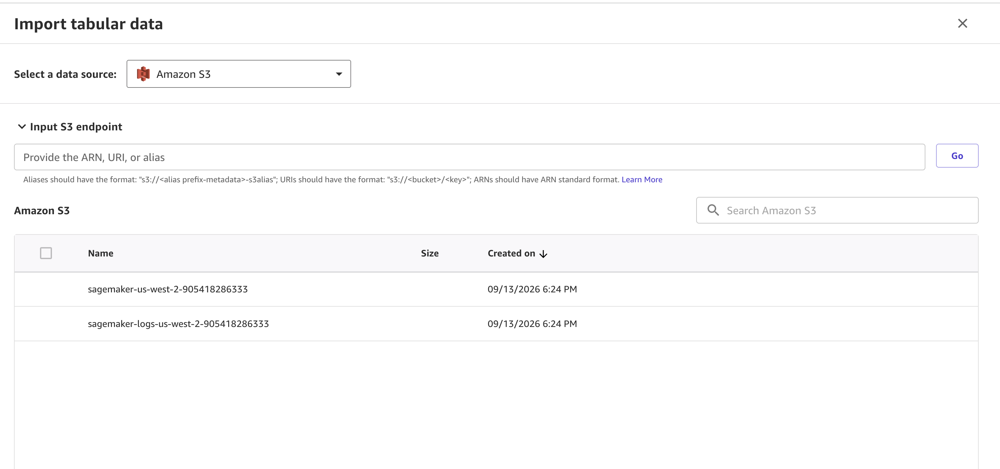

データソースの選択で **Amazon S3** を選びます。表示される S3 バケットの一覧から自分のバケットを開き、フォルダをたどって `canvas_dataset.csv` を選びます。フォルダ構造は全員共通で、`（自分のバケット）/tokyo-port-wave-height/canvas/canvas_dataset.csv` です。

1. `sagemaker-` で始まるバケット（自分のアカウント ID が入ったもの）を開く
2. `tokyo-port-wave-height` フォルダを開く
3. `canvas` フォルダを開く
4. `canvas_dataset.csv` を選ぶ

> ⚠️ **バケット名は参加者ごとに異なります**。1.2 で使う S3 バケットは `sagemaker-<リージョン>-<AWS アカウント ID>` という命名規則で自動作成される SageMaker の既定バケットです。アカウント ID の部分が各自で違うため、手順書に書かれたバケット名（例のアカウント ID を含むもの）はそのままでは使えません。自分のパスは 1.2 の出力で必ず確認してください。

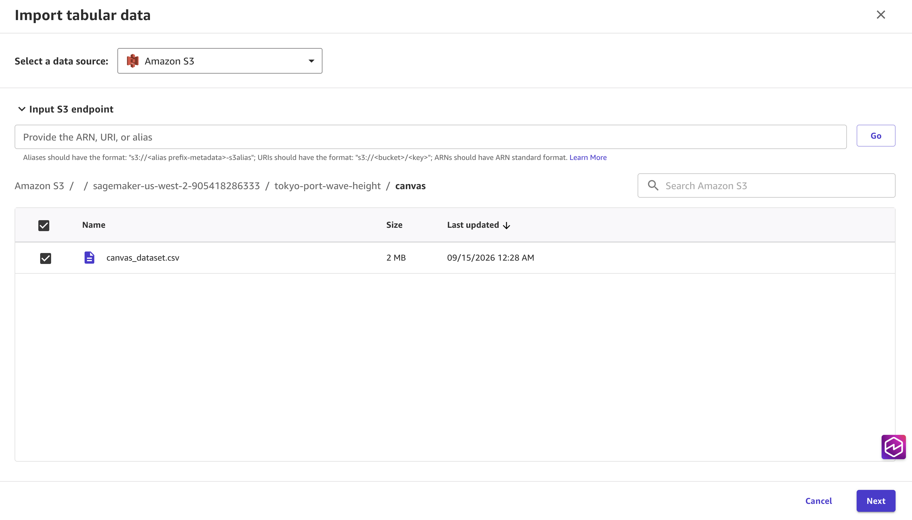

表示された `canvas_dataset.csv` のチェックボックスを選び、**Next** を選択します。

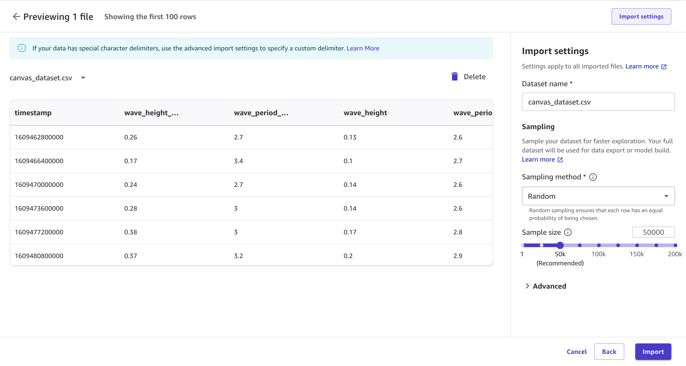

**Preview data** でプレビューを確認してから **Save** を選択します。

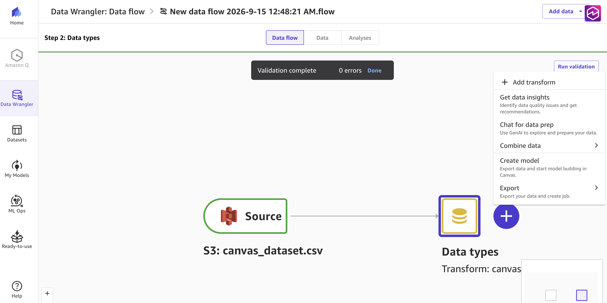

Canvas がスキーマを検証してプレビューを表示します。**source**（読み込んだ CSV）と、自動的な **データ型推論** ステップが追加されます。

### 1.5 Data Insights レポートを実行する

> ℹ️ **Data Quality and Insights（DQI）レポートとは**: Canvas / Data Wrangler が提供する、データの品質・統計・モデルへの適合度を自動分析する機能です。欠損値の割合や外れ値、各特徴量の予測力などを、モデルを学習する前に確認できます。

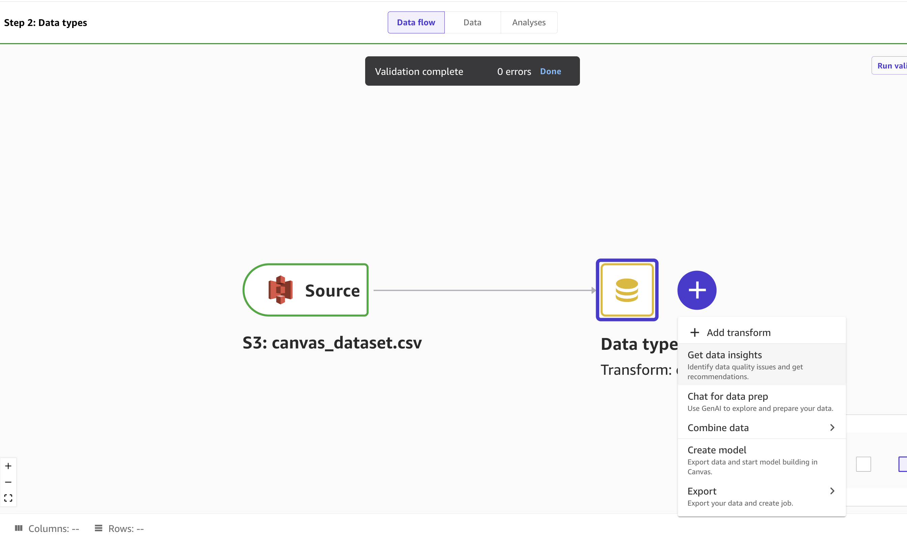

**＋ → Get data insights** をクリックします。

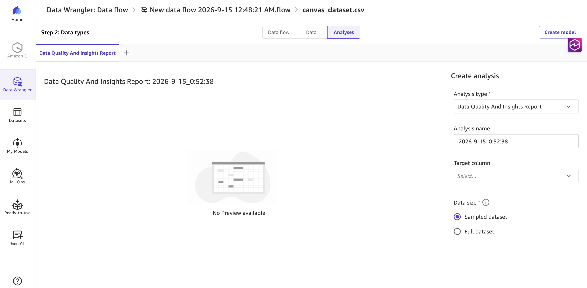

以下のとおり設定します。

| 設定項目 | 設定する値 |
|---|---|
| Analysis type | `Data Quality and Insights Report` |
| Analysis name | 任意の名前（例: `wave-height-dqi`） |
| Target column | `wave_height` |
| Problem type | `Regression` |
| Data size | `Sampled dataset`（既定のサンプルで十分。全件を使う場合は `Full dataset` を選ぶと SageMaker Processing ジョブが起動します） |

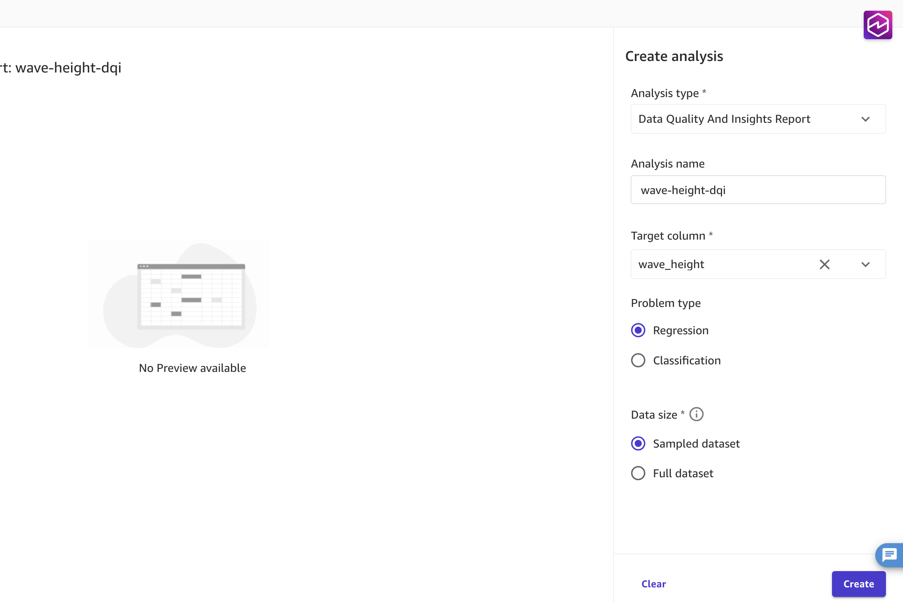

設定後、**Create** を選択するとレポートが生成されます。

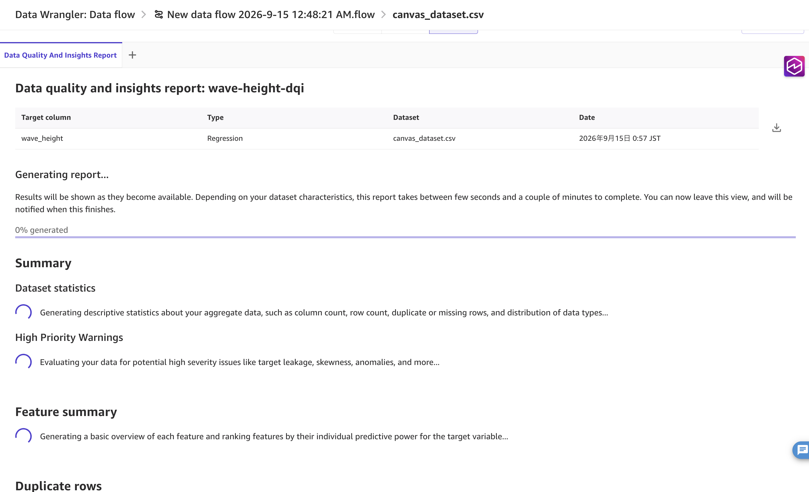

レポートはすぐには表示されません。しばらく（数分程度）待つと生成が完了し、DQI レポートが表示されます。

> ℹ️ **参考: Get data insights の Analysis type 一覧**
>
> | Analysis type | 内容 |
> |---|---|
> | Data Quality and Insights Report | データ全体の品質・統計・目的変数との関係を1つのレポートにまとめる（今回使用） |
> | Bias Report | 目的変数と、バイアスの疑いがある列（facet variable）の関係を分析し、データの偏りを検出する |
> | Histogram | 特定の列の値の分布（度数）を表示する |
> | Scatter plot | 2つの数値列の関係を散布図で可視化する |
> | Table Summary | 各列の統計量（件数・最小・最大・平均・標準偏差など）を一覧表示する |
> | Quick Model | ランダムフォレストで簡易モデルを学習し、特徴量重要度とモデル精度を確認する |
> | Target Leakage | 目的変数と強く相関しすぎている列（リーケージの疑いがある列）を検出する |
> | Multicollinearity | 特徴量同士の多重共線性を VIF・PCA・Lasso 特徴選択のいずれかで確認する |
> | Time Series | 時系列データの季節性・トレンド分解や異常値検知を行う |
> | Custom visualization | 自分でコードを書いて独自の可視化を作成する |
>
> 出典: [Perform exploratory data analysis (EDA) - Amazon SageMaker AI](https://docs.aws.amazon.com/sagemaker/latest/dg/canvas-analyses.html)

### 1.6 冗長な列を削除する

このデータセットには目的変数（`wave_height`）に対して直接的すぎる、または今回のタスクでは使わない列（`wave_height_max`、`wave_period_max`、`wave_dir`、`current_dir`、`current_speed`、`tide_level`）が含まれます。これらを削除します。

データ型ノードの **＋** をクリック → **Add transform → Manage columns** で、以下の列を削除します。

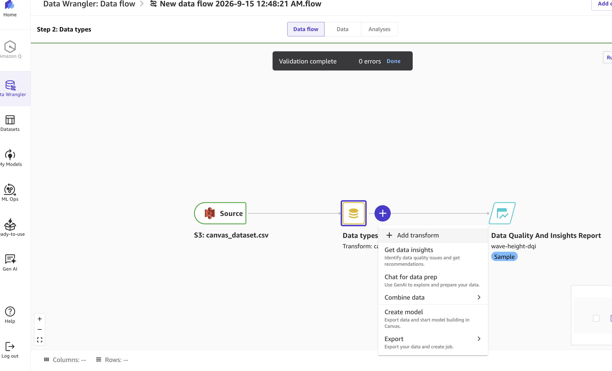

> ℹ️ Manage columns の一覧は、数値列（Numeric）がアルファベット順、続いて文字列列（String）がアルファベット順で表示されます。以下はその表示順に並べています。

- `current_speed`（潮流の速さ。波高とはほぼ無相関で、今回のタスクでは使わない）
- `tide_level`（潮位。基準面からの高さ。今回のタスクでは使わない）
- `wave_height_max`（最高波高。目的変数から単純な比率で計算されているため、含めるとリーケージになる）
- `wave_period_max`（最高波の周期。目的変数と強く連動するため、含めるとリーケージになる）
- `current_dir`（潮流の向き。波高とはほぼ無相関）
- `wave_dir`（波の向き。有義波高が 25cm 未満では欠測になる仕様のため、リーケージ的な情報を含む）

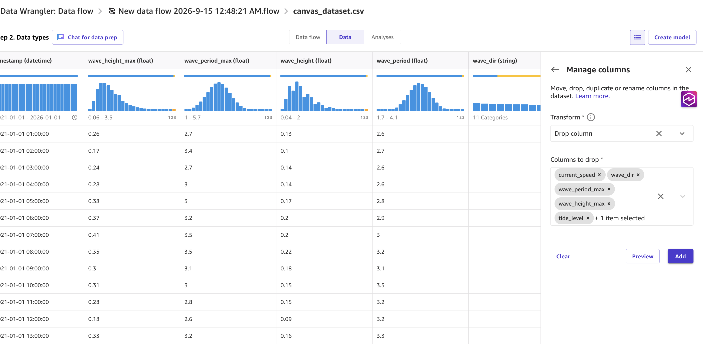

**Preview** で影響を確認し、**Add** でステップを確定します。

残るのは `timestamp`、`wind_dir`、`wind_speed`、`wave_period`、`wave_height`（目的変数）です。

## 2. Canvas によるモデル構築

### 2.1 モデルを学習する（事前実行済み）

データフローから **＋** をクリックします。

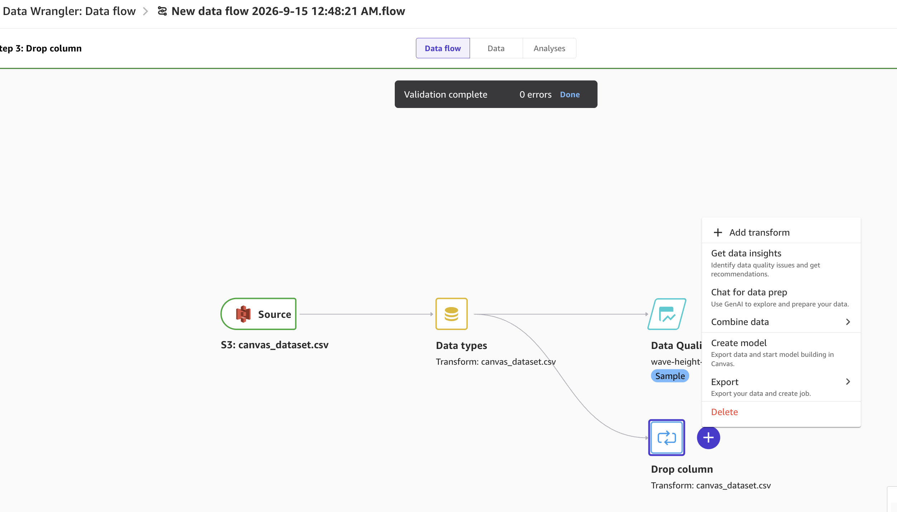

**Export to create a model** 画面が開きます。以下のとおり設定します。

| 設定項目 | 設定する値 |
|---|---|
| Dataset name | 任意の名前（例: `wave_height_dataset`） |
| Process entire dataset | オンのまま（データセット全件を使ってモデルを作る） |
| Model name | 任意の名前（例: `WaveHeightModel`） |
| Problem type | `Predictive analysis` |
| Target column | `wave_height` |

**Problem type** には次の 3 種類があります。

| Problem type | 内容 |
|---|---|
| Predictive analysis | 表形式データを使い、単一・複数カテゴリの分類、回帰、時系列予測を行う（今回使用） |
| Text analysis | 表形式データを使い、テキスト分類（単一・複数カテゴリ）を行う |
| Fine-tune foundation model | 基盤モデルを自分のデータでファインチューニングし、特定タスク・ドメインでの性能を高める |

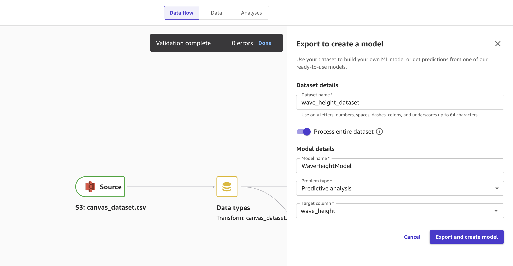

**Export and create model** を選択すると、モデルのビルド画面に移動します。

### 2.1.1 モデルタイプを Numeric model type に変更する

データセットに `timestamp` 列があるため、Canvas は既定で **Time series forecasting**（時系列予測）を推奨（選択済み）にしています。しかし今回のタスクは「同時刻の風向・風速から波高を推定する」という回帰問題であり、過去の値から将来の値を予測する時系列予測ではありません。**Configure model** を開き、モデルタイプを手動で変更します。

| 選択肢 | 内容 | 今回選ぶか |
|---|---|---|
| Time series forecasting | 過去の値の推移から将来の値を予測する（例: 来月の売上、季節ごとの必要在庫） | 選ばない（既定で選択されているので変更する） |
| Numeric model type | 他の列の値から目的変数の値を推定する、いわゆる回帰（例: 配送に何日かかるか） | **こちらを選ぶ** |
| 2 category model | 2 択の分類（例: 顧客が離脱するかどうか） | 選ばない |
| 3+ category model type | 3 択以上の分類 | 選ばない |

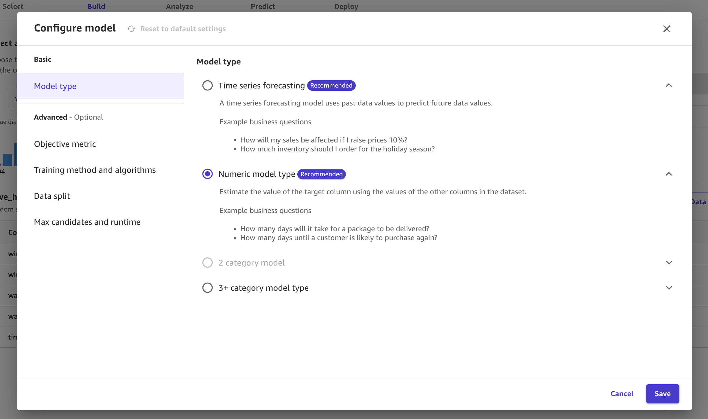

**Model type** で **Numeric model type** を選びます。**We don't recommend using a numeric model to make predictions for wave_height** という警告が表示されますが、これは `timestamp` 列があることに対する注意（時系列予測を推奨する）であり、今回は意図的に回帰を選んでいるため、そのまま **Save** を選択して進めて問題ありません。

> ℹ️ **参考: Configure model の Advanced settings**（本ラボでは既定値のまま使用）
>
> | 設定項目 | 内容 |
> |---|---|
> | Objective metric | Canvas が学習時に最適化する評価指標。指定しない場合は Canvas が既定の指標を自動選択する |
> | Training method | `Auto`、`Ensemble`、`Hyperparameter optimization (HPO) mode` から選ぶ。学習方法（アルゴリズム自動選択・複数モデルの組み合わせ・ハイパーパラメータ探索）を切り替える |
> | Algorithms | モデル候補の生成に使うアルゴリズムを選択する（下表参照） |
> | Data split | 学習データ（Training set）と検証データ（Validation set）の割合（%）を指定する |
> | Max candidates and runtime | Canvas が生成する候補モデルの最大数（HPO mode のみ）と、学習にかける最大時間を指定する |
>
> 出典: [Build a model - Amazon SageMaker AI](https://docs.aws.amazon.com/sagemaker/latest/dg/canvas-build-model-how-to.html)
>
> **Training method ごとに選択できる Algorithms:**
>
> | Training method | 選択できるアルゴリズム | 内容 |
> |---|---|---|
> | Ensemble mode | LightGBM | 勾配ブースティングの決定木アルゴリズム。木を深さ方向ではなく幅方向に広げ、速度に最適化されている |
> | Ensemble mode | CatBoost | 勾配ブースティングの決定木アルゴリズム。カテゴリ変数の扱いに最適化されている |
> | Ensemble mode | XGBoost | 勾配ブースティングの決定木アルゴリズム。木を深さ方向に広げる（プロコード側で使っているものと同系統） |
> | Ensemble mode | Random Forest | 複数の決定木をランダムな部分サンプルで学習し、結果を平均して過学習を防ぐ |
> | Ensemble mode | Extra Trees | Random Forest に似るが、全データを使い分割点もランダムに決める。ランダム性が Random Forest より高い |
> | Ensemble mode | Linear Models | 変数間の関係を線形の式でモデル化する |
> | Ensemble mode | Neural network torch | PyTorch で実装されたニューラルネットワーク |
> | Ensemble mode | Neural network fast.ai | fast.ai で実装されたニューラルネットワーク |
> | HPO mode | XGBoost | 複数の弱学習器を組み合わせて目的変数を予測する教師あり学習アルゴリズム |
> | HPO mode | Deep learning algorithm | 多層パーセプトロン（MLP）によるニューラルネットワーク。線形分離できないデータも扱える |
>
> 出典: [Advanced model building configurations - Amazon SageMaker AI](https://docs.aws.amazon.com/sagemaker/latest/dg/canvas-advanced-settings.html)

- **モデルタイプ**: `Numeric model type`（回帰。`wave_height` は連続値なので Canvas が候補として提示するが、既定選択は timestamp 列の存在により Time series forecasting になっているため手動で変更が必要）
- **学習方法**: `Quick build`（本ラボでは事前実行済みのものを開く）

> ℹ️ **参考: Quick build と Standard build の違い**
>
> | | Quick build | Standard build |
> |---|---|---|
> | 目的 | 速度を優先する簡易モデル。データ変更の影響を素早く確認するのに向く | 精度を優先する、AutoML によるモデル探索（アルゴリズム選択・ハイパーパラメータ調整など） |
> | 所要時間の目安 | 数分程度 | 数十分〜数時間程度（データサイズに依存） |
> | 制約 | データセットが 50,000 行未満である必要がある | 制約なし |
>
> 本データセットは約 43,800 行なので Quick build の制約を満たします。出典: [Train a time series forecasting model faster with Amazon SageMaker Canvas Quick build](https://aws.amazon.com/blogs/machine-learning/train-a-time-series-forecasting-model-faster-with-amazon-sagemaker-canvas-quick-build/)

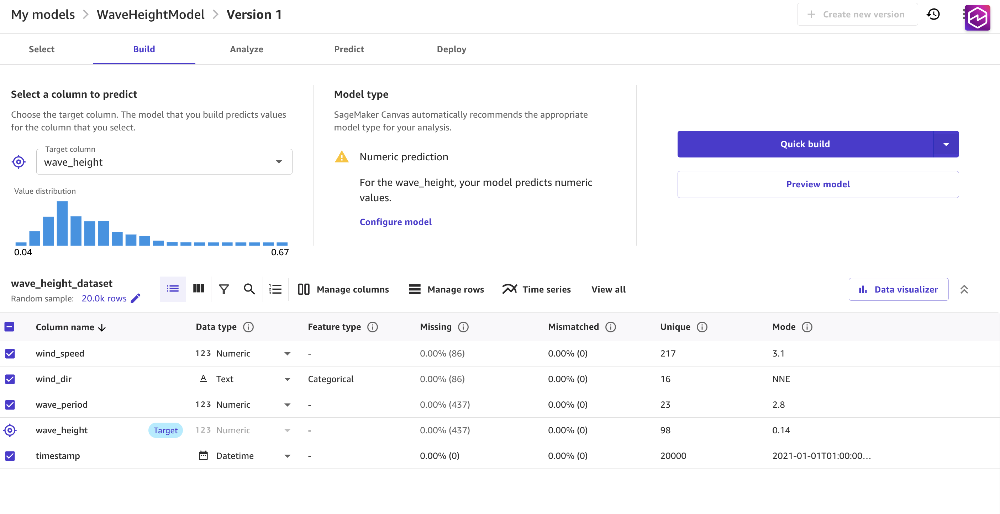

**Quick build** を選択すると、モデルのビルドが始まります。

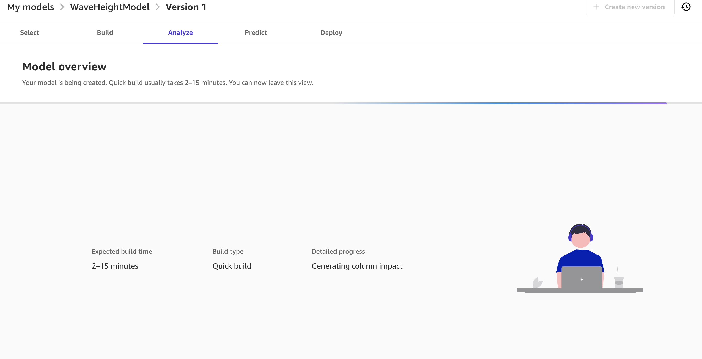

> ℹ️ 講師は事前に Quick build を実行済みです。当日はこの画面まで操作を見せ、その後に完成済みの結果画面（Analyze タブ）を開きます。

### 2.2 モデルを評価する

学習が完了すると Canvas は **Analyze** タブを開きます。

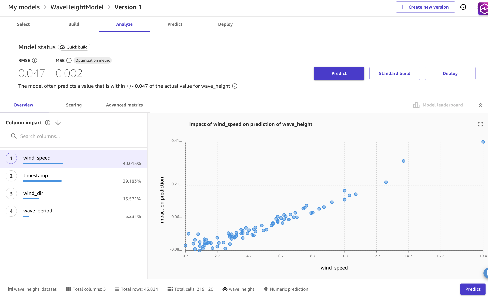

**Overview タブ — Column impact**: `wind_speed` が最も重要な特徴量として表示されることを確認します。プロコード（XGBoost）での特徴量重要度（風速が最大、次に風向の東西成分）と比較してください。

**Advanced metrics タブ**: 回帰の指標（RMSE、MAE、R² 等）を確認します。

> ℹ️ **参考: Analyze タブの各タブ・各値が示すもの**（回帰モデルの場合）
>
> | タブ | 表示内容 |
> |---|---|
> | Overview | **Column impact**（各列がどの程度予測に影響しているかを示す割合。合計で 100% になる）と、**Optimization metric** のスコア（モデル構築時に最適化対象として選んだ指標。既定では RMSE） |
> | Scoring | 予測値と実際の値の関係を線で可視化したもの。線の周りの紫色の帯は RMSE の範囲を示し、実際の値はおおむねこの範囲内に収まる。帯が太くなっている区間は、そのあたりでの予測精度が低いことを意味する |
> | Advanced metrics | より詳細な指標（下表）とパフォーマンス分析 |
>
> **Advanced metrics タブの回帰指標:**
>
> | 指標 | 意味 |
> |---|---|
> | RMSE（Root Mean Squared Error） | 予測値と実際の値の差を 2 乗して平均し、平方根を取った値。誤差が大きいほど値も大きくなる（元の単位、今回は m） |
> | MAE（Mean Absolute Error） | 予測値と実際の値の差の絶対値の平均。RMSE より大きな誤差に引かれにくい指標 |
> | MSE（Mean Squared Error） | 予測値と実際の値の差を 2 乗して平均した値（RMSE を 2 乗する前の値） |
> | R²（決定係数） | 目的変数の変動のうち、入力列（特徴量）で説明できる割合。1 に近いほど当てはまりが良く、0 は「平均値で予測するのと同程度」、負の値は「平均値で予測するより悪い」ことを示す |
>
> 出典: [Evaluate your model's performance](https://docs.aws.amazon.com/sagemaker/latest/dg/canvas-scoring.html)、[Model quality metrics and Amazon CloudWatch monitoring](https://docs.aws.amazon.com/sagemaker/latest/dg/model-monitor-model-quality-metrics.html)

> ℹ️ **プロコードとの比較**: [手順書.md](./手順書.md) の「2. 学習とデプロイ」で作った XGBoost モデルの R²（概ね 0.4〜0.5）と、Canvas AutoML の R² を比較してみましょう。同じデータ・同じタスクに対して、ノーコードとプロコードでどれくらい近い結果になるかを確認します。AutoML は候補選択に確率的要素を含むため、厳密には毎回結果が変わります。

### 2.3 予測を生成する

**Predict** タブ → **Single prediction** で、風向・風速の値を変えながら予測がどう動くかを確認します。

**Predict target values** 画面には次の 4 つの列が表示されます。

- `timestamp`（観測日時）
- `wave_period`（波の周期。1 つの波が来てから次の波が来るまでの時間）
- `wind_dir`（風向）
- `wind_speed`（風速）

今回確認したいのは「風向・風速を変えると波高の予測値がどう動くか」なので、`wind_dir` と `wind_speed` を変更します。

- `wind_speed` を大きくする（例: `3.1` → `10.0`）と、波高の予測値が上がることを確認します
- `wind_dir` を `NNE` から `S`（南）に変えると、`N` 系の風向より波が立ちやすいため予測値が上がることを確認します。逆に `NW`（北西）に近い風向にすると予測値は下がります

> ℹ️ **なぜ風向で波高が変わるのか**: 擬似データ生成時に、南〜南南西の風で波が立ちやすく、西〜北西の風では立ちにくいという東京港の実データの傾向（風の東西成分の寄与が大きい）を模しています。方位ごとの倍率は `S`（南）が最大の `1.30`、`NW`（北西）が最小の `0.70` です。`timestamp` と `wave_period` は変えても、今回確認したい「風→波高」の関係の説明には直接関わりません。

## 3. まとめ（プロコードとノーコードの比較）

| 観点 | プロコード（XGBoost） | ノーコード（Canvas AutoML） |
|---|---|---|
| モデルの選定 | `ModelTrainer` で XGBoost を明示的に指定 | Canvas が候補を自動探索 |
| 学習コード | `scripts/train.py` を自分で書く | 不要 |
| 特徴量エンジニアリング | Processing ジョブで風向を sin/cos 変換 | Canvas の変換機能（または DQI の指示に従う） |
| 実験管理 | MLflow で複数実行を比較 | Canvas のモデルリーダーボード |
| デプロイ | `ModelBuilder` でエンドポイント作成 | Canvas の Deploy タブでワンクリック |

**どちらを選ぶべきか**: 反復速度と非エンジニアへの説明しやすさを重視するなら Canvas、再現性・CI/CD・推論時のカスタムロジックが必要ならプロコードです。Canvas は AutoML パイプライン全体を Jupyter ノートブックとしてエクスポートできるため、「Canvas で始めて、必要になったらコードへ卒業する」という経路も取れます。

### クリーンアップ

Canvas でエンドポイントをデプロイした場合は、**Deploy タブからデプロイを削除してください。** Canvas 自体はアイドル時に自動停止しますが、デプロイしたエンドポイントは自動停止しません。本ラボで実際にデプロイした場合は忘れずに削除してください。

## 参考

Canvas をより深く扱う内容（画像・テキストモデル、ファインチューニング、スケジュール予測など）は、専用の [SageMaker Canvas Immersion Day](https://catalog.workshops.aws/canvas-immersion-day/en-US) を参照してください。
