# 東京港（擬似）観測データによる波高推定ワークショップ 手順書

> 東京港の海象観測データを用いた、風向・風速から有義波波高を推定するワークショップです。使用するデータは実データの統計的性質を再現した**合成（擬似）データ**です。

## 目次

1. [前提条件（環境セットアップ）](#1-前提条件環境セットアップ)
2. [学習とデプロイ](#2-学習とデプロイ)
   - [2.0 セットアップ（ノートブック セクション 0）](#20-セットアップノートブック-セクション-0)
   - [2.1 データ準備（ノートブック セクション 1）](#21-データ準備ノートブック-セクション-1)
   - [2.2 モデル学習（2 本並列）（ノートブック セクション 2）](#22-モデル学習2-本並列ノートブック-セクション-2)
   - [2.3 MLflow による実行比較（ノートブック セクション 3）](#23-mlflow-による実行比較ノートブック-セクション-3)
   - [2.4 デプロイ（Data Capture 有効）（ノートブック セクション 4）](#24-デプロイdata-capture-有効ノートブック-セクション-4)
   - [2.5 推論確認（ノートブック セクション 5）](#25-推論確認ノートブック-セクション-5)
3. [モニタリング（ドリフト検知）（ノートブック セクション 6）](#3-モニタリングドリフト検知ノートブック-セクション-6)
4. [Canvas によるノーコード体験（追加ラボ）](#4-canvas-によるノーコード体験追加ラボ)

---

# 1. 前提条件（環境セットアップ）

どのラボを始める場合も、Amazon SageMaker Studio 環境へのアクセスが必要です。本ワークショップはワークショップ用に払い出された AWS アカウントを使用します。

> ℹ️ 目安時間: 20〜25 分

## 1.1 AWS アカウントにアクセスする

運営担当者の指示に従い、ワークショップ用の AWS アカウントにログインしてください。

> ⚠️ **個人アカウントや業務用アカウントは使用しないでください。** 事前構築済みのロール・権限が存在しないため、ラボが動作しません。

## 1.2 リージョンを切り替える

AWS マネジメントコンソールの右上で、**講師から指示されたリージョン**に切り替えてください。

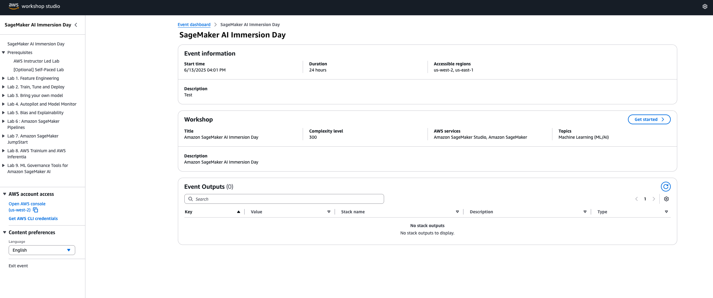

> ⚠️ 下の画像では一例のリージョンが表示されていますが、**正しいリージョンは必ず講師の指示に従ってください。**
> SageMaker Studio 対応リージョンの一覧は [こちら](https://docs.aws.amazon.com/sagemaker/latest/dg/studio.html)。

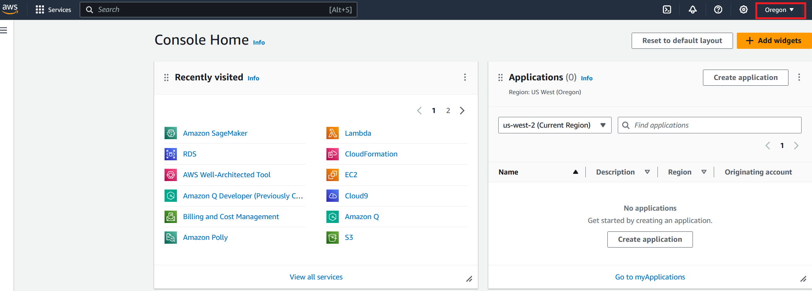

> ⚠️ **リージョンがずれると、以降のすべての手順が失敗します。** 必ず講師の指示に従ってください。

## 1.3 Amazon SageMaker Studio へアクセスする

1. サービス検索で **Amazon SageMaker AI** を検索して開く

   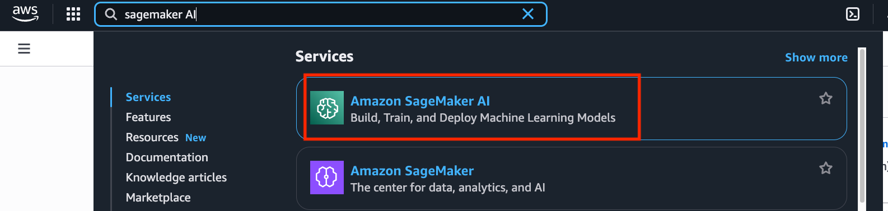

2. 左メニューの **Applications and IDE** の下にある **Studio** をクリックする

   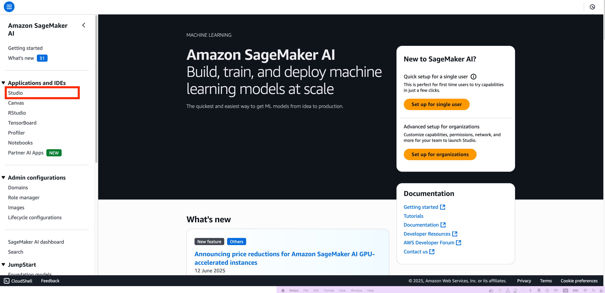

3. ユーザープロファイルが既に作成されています。**Open Studio** をクリックする

   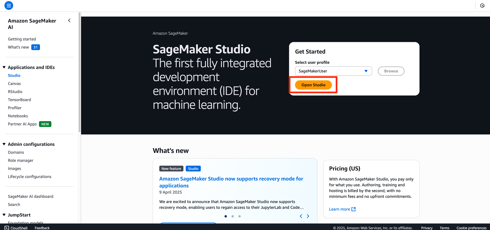

4. 初回アクセス時は読み込みに 1〜2 分かかります。新しいタブで SageMaker Studio が開きます

   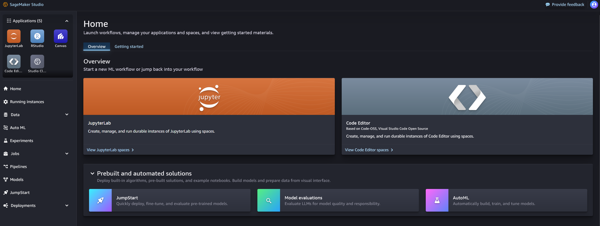

## 1.4 JupyterLab Space を作成する

1. SageMaker Studio の **Applications** メニューで **JupyterLab** を選択する
2. **Create JupyterLab space** を選択する

   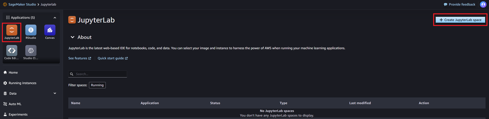

3. **Name** に Space の名前（例: `wave-lab`）を入力し、**Create space** を選択する

   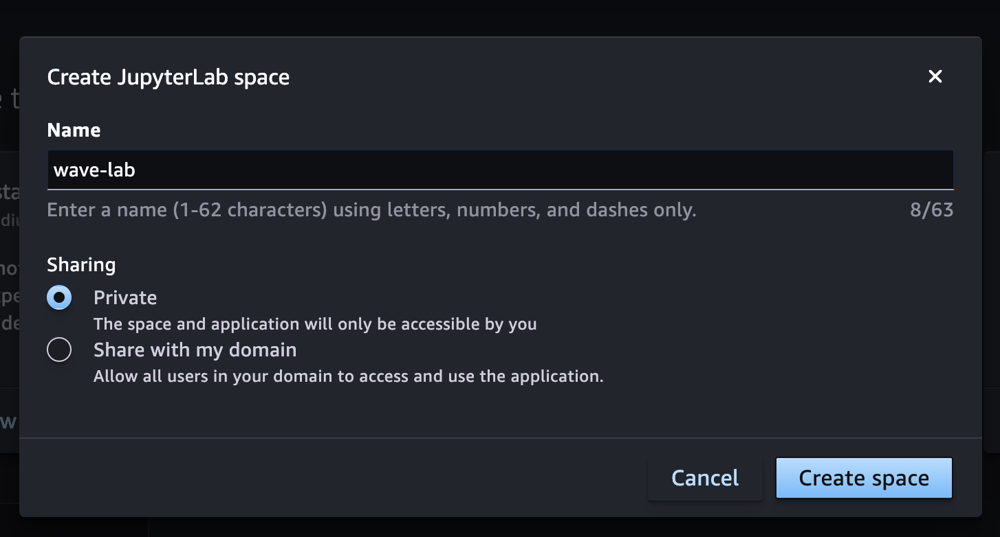

> ℹ️ 共有設定を選ぶ画面が出た場合は **Private** を選んでください。参加者ごとに独立した環境で作業するためです。

4. **Run space** を選択する前に、以下の設定を確認してください。

| 項目 | 設定値 |
|---|---|
| インスタンスタイプ | `ml.m5.2xlarge` |
| ディスク容量 | 50 GB |
| **Image（SageMaker Distribution イメージ）** | **`4.4.1`** |

> ⚠️ **重要: Image を必ず `4.4.1` に設定してください。**
> 本ワークショップのノートブックは SageMaker Distribution **4.4.1** ＋ SageMaker Python SDK **3.20.0** で検証されています。Space は既定で古いイメージになっていることが多く、バージョン不整合はラボ途中の `ImportError` / `AttributeError` の最大の原因です。
> すでに別イメージで起動している場合は、**Space を停止 → イメージを 4.4.1 に変更 → 再起動** してください。

5. **Run space** を選択して Space を起動する

   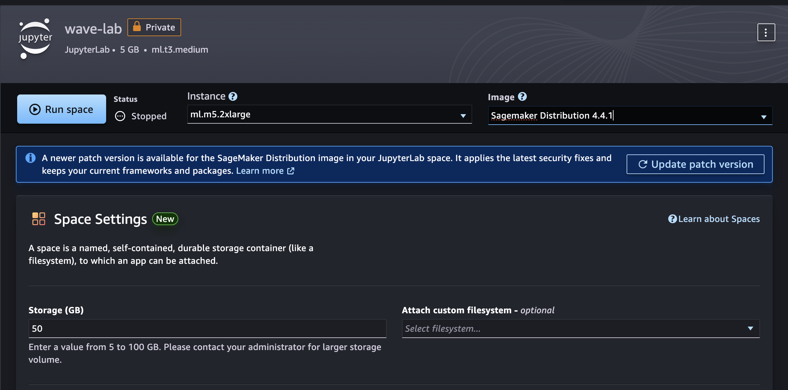

> ℹ️ Space の起動には数分かかります。この待ち時間は、次のラボの説明（SDK の概要）を聞きながら過ごせます。

Space が起動すると、状態が **Running** に変わります。

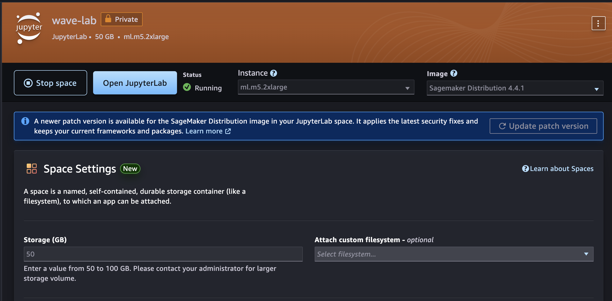

✅ これで Space の作成が完了しました。

## 1.5 ノートブック・スクリプトを取得する

1. **Open JupyterLab** を選択する
2. JupyterLab で **Terminal** アイコンをクリックする

   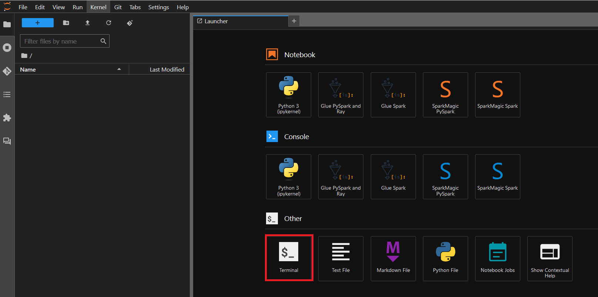

3. ターミナルで、本ワークショップのリポジトリを取得します。

```bash
# ワークショップのノートブック・スクリプトを取得
git clone https://github.com/TMirai/sagemaker-workshop-wave-height-2026.git
```

> ℹ️ 含まれるのは自作のノートブック・スクリプト・合成データ生成スクリプトのみで、実データは含まれません。

4. 完了すると、JupyterLab の左パネルにフォルダが作成されます。フォルダの中に `workshop.ipynb` があることを確認してください。

## 1.6 `workshop.ipynb` を開く

1. JupyterLab の左パネルから `workshop.ipynb` をダブルクリックして開く
2. カーネルとして **Python 3 (ipykernel)** を選択する

以降、このノートブックを上から順にセルを実行していく形式で進めます。本手順書の各章がノートブックのセクションに対応しています。

## 1.7 このワークショップで作るもの

風向・風速から有義波波高を推定する回帰モデルを、SageMaker の一連の機能（データ準備・学習・実験管理・デプロイ・モニタリング）を使って構築します。

> ℹ️ **このモデルの位置づけ**: 作るのは「同時刻の風向・風速から、同時刻の有義波波高を推定する回帰モデル」です。数時間先を予測する時系列モデルや、気象庁が運用する数値波浪モデルとは異なります。

### 進め方

`workshop.ipynb` は 1 本のノートブックに、以下 8 セクション（**セクション 0 〜 7** という見出しがノートブック内に書かれています）がまとまっています。上から順に実行してください。

> ℹ️ **表の読み方**: 「ノートブックのセクション」列は `workshop.ipynb` を開いたときに実際に見える見出し番号です。「本手順書の章」列は、そのセクションの操作をこの手順書のどこで解説しているかを示します。**この 2 つの番号は別の体系なので、一致しません。** 本手順書の各見出しには `【ノートブック セクション N】` という表記を付けているので、ノートブックとの対応はそちらで確認してください。

| ノートブックのセクション | 内容 | 目安時間 | 本手順書の章 |
|---|---|---|---|
| セクション 0 | セットアップ（依存関係のインストール、MLflow App への接続） | 数分 | [2.0](#20-セットアップノートブック-セクション-0) |
| セクション 1 | データ準備（擬似データ生成 → S3 アップロード → Processing ジョブで前処理） | 5〜10 分 | [2.1](#21-データ準備ノートブック-セクション-1) |
| セクション 2 | モデル学習（2 本並列）（ハイパーパラメータの異なる 2 つの学習ジョブを並列投入） | 5〜10 分 | [2.2](#22-モデル学習2-本並列ノートブック-セクション-2) |
| セクション 3 | MLflow による実行比較（2 つの実行を MLflow UI・コードで比較） | 10〜15 分 | [2.3](#23-mlflow-による実行比較ノートブック-セクション-3) |
| セクション 4 | デプロイ（最良モデルをエンドポイントにデプロイ、Data Capture 有効） | 5〜10 分 | [2.4](#24-デプロイdata-capture-有効ノートブック-セクション-4) |
| セクション 5 | 推論確認（エンドポイントを呼び出して予測を確認） | 数分 | [2.5](#25-推論確認ノートブック-セクション-5) |
| セクション 6 | モニタリング（正常系・異常系データでドリフト検知） | 15〜20 分 | [3](#3-モニタリングドリフト検知ノートブック-セクション-6) |
| セクション 7 | まとめ（振り返りと発展方向） | — | [3.9](#39-まとめノートブック-セクション-7) |

**ノートブックのセクション 2（学習ジョブ投入）とセクション 4（デプロイ投入）は `wait=False` で実行されるため、投入後すぐに次のセルへ進めます。** ジョブが裏で進行している間に、次のセクションの説明を読み進めてください（本手順書でも、その旨をその都度案内します）。

準備ができたら [2. 学習とデプロイ](#2-学習とデプロイ) に進んでください。

---

# 2. 学習とデプロイ

対応するノートブック: `workshop.ipynb` セクション 0, 1, 2, 4, 5

モダンな SageMaker SDK（`ModelTrainer` / `ModelBuilder`）を使って、風向・風速から有義波波高を推定する XGBoost 回帰モデルを、データ準備からデプロイまで一気通貫で構築します。学習は 2 つのハイパーパラメータ設定を**並列**で実行し、その比較は [2.3 MLflow による実行比較](#23-mlflow-による実行比較ノートブック-セクション-3) で行います。

> ℹ️ 目安時間: 25〜35 分（学習・デプロイのジョブ実行時間を含む）

## 2.0 セットアップ（ノートブック セクション 0）

`workshop.ipynb` の一番上から順にセルを実行します。

### (1) 依存関係のインストール

最初のコードセルで、`requirements.txt` に書かれた依存関係を `uv` でインストールします。

```python
# --- 依存関係のインストール（uv で高速に） -----------------------------------
import sys
!pip install -q uv
!uv pip install -q --python {sys.executable} -r requirements.txt
```

> ℹ️ カーネルの再起動が必要な場合は、次のセルのコメントアウトを外して実行してください。通常は不要です。

### (2) SageMaker セッション・実行ロールを取得する

```python
import boto3, json, os, time
from datetime import datetime
import numpy as np
import pandas as pd
from sagemaker.core.helper.session_helper import Session, get_execution_role
from sagemaker.core import image_uris

# SageMaker / boto3 のセッションを作成する
session = Session()
boto_session = boto3.Session()
# このワークショップで使う S3 バケット（既定のバケットが自動的に作成される）
bucket = session.default_bucket()
# S3 上のオブジェクトキーの接頭辞（ワークショップ専用の名前空間）
prefix = "tokyo-port-wave-height"
region = session.boto_region_name
# Studio の実行ロール（このロールの権限で各 AWS API を呼び出す）
role = get_execution_role()
sm_client = boto_session.client("sagemaker")
```

`bucket`、`role` などがこの後のすべての手順で使われます。エラーなく出力されることを確認してください。

### (3) MLflow App に接続する（無ければ自動作成）

> ℹ️ **MLflow とは**: 機械学習の実験（学習ジョブ 1 回分の実行）を記録・比較するためのオープンソースツールです。ハイパーパラメータ・評価指標・モデル本体などを「実行（Run）」単位で保存し、複数の実行を並べて比較できます。手動で Excel にハイパーパラメータと精度を書き留めていくような作業を自動化・体系化するものだと考えてください。**Amazon SageMaker Managed MLflow** は、この MLflow のサーバー部分（トラッキングサーバー）を AWS がマネージドで提供する機能で、自分でサーバーを構築・運用する必要がありません。ここで作成する「MLflow App」がそのサーバーの実体です。

`mlflow-app-workshop` という名前の MLflow App を探し、無ければ新規作成します。

```python
import mlflow

mlflow_name = "mlflow-app-workshop"
# 既存の MLflow App を名前で検索する
apps = sm_client.list_mlflow_apps().get("Summaries", [])
mlflow_app = next((a for a in apps if a["Name"] == mlflow_name), None)

if mlflow_app:
    # 既存の MLflow App が見つかった場合はそれを使う
    print(f"Using existing MLflow App: {mlflow_app['Name']}")
    mlflow_app = sm_client.describe_mlflow_app(Arn=mlflow_app["Arn"])
else:
    # 見つからない場合は新規に MLflow App を作成する
    response = sm_client.create_mlflow_app(
        Name=mlflow_name,
        ArtifactStoreUri=f"s3://{bucket}",
        RoleArn=role,
        ModelRegistrationMode="AutoModelRegistrationEnabled",
    )
    # 作成が完了（Created/Updated）するか、失敗するまでポーリングする
    while True:
        mlflow_app = sm_client.describe_mlflow_app(Arn=response["Arn"])
        if mlflow_app["Status"] in ["Created", "Updated"]:
            break
        elif mlflow_app["Status"] in ["CreateFailed", "Deleted"]:
            raise RuntimeError(f"MLflow App creation failed: {mlflow_app['Status']}")
        time.sleep(30)

mlflow_app_arn = mlflow_app["Arn"]
mlflow_experiment_name = "tokyo-port-wave-height"
# 以降の mlflow.* 呼び出しがこの MLflow App / Experiment に記録されるよう設定する
mlflow.set_tracking_uri(mlflow_app_arn)
mlflow.set_experiment(mlflow_experiment_name)
```

初回は MLflow App の作成に約 2 分かかります。作成中の状態は、SageMaker Studio の **Applications** メニューから **MLflow** を開くと確認できます（`mlflow-app-workshop` が `Creating` → `Created` に変わっていく様子が見られます）。

> ⚠️ **権限エラーが出た場合**: `AccessDenied` 等のエラーが出た場合、実行ロールに MLflow App 関連の権限（`sagemaker:CreateMlflowApp` 等）が付いていない可能性があります。講師に確認してください。この場合、[2.3 MLflow による実行比較](#23-mlflow-による実行比較ノートブック-セクション-3) と、[3. モニタリング](#3-モニタリングドリフト検知ノートブック-セクション-6) の MLflow への記録部分はスキップし、講師のデモ画面で代替します。

## 2.1 データ準備（ノートブック セクション 1）

### (1) 擬似観測データを生成する

```python
!python generate_synthetic_data.py --output data/observation.csv --start-year 2021 --end-year 2025 --seed 42
```

東京港の実データの統計的性質（風速と波高の相関 0.72、季節性、年ごとの分布変化など）を再現した合成データが `data/observation.csv` に生成されます。実行後、行数や統計量の要約が表示されます。

```python
# 生成した擬似観測データを読み込んで確認する
observation_df = pd.read_csv("data/observation.csv", parse_dates=["timestamp"])
print(f"生成された行数: {len(observation_df):,}")
observation_df.head()
```

生成される `observation_df`（`data/observation.csv`）の列は次の通りです。

| 列名 | 型 | 説明 | 本ワークショップでの用途 |
|---|---|---|---|
| `timestamp` | datetime | 観測時刻（1 時間おき） | 時系列分割・月（季節性）特徴量の元 |
| `wind_dir` | str | 風向（16 方位 `N`〜`NNW`） | **特徴量**（sin/cos に変換して使用） |
| `wind_speed` | float | 風速（m/s） | **特徴量** |
| `wave_height` | float | 有義波波高（m） | **目的変数**（推定対象） |
| `wave_period` | float | 有義波周期（s） | 未使用（Canvas ラボで削除対象） |
| `wave_height_max` | float | 最高波波高（m） | 未使用（`wave_height` から単純比率で計算されるためリーケージ、Canvas ラボで削除対象） |
| `wave_period_max` | float | 最高波周期（s） | 未使用（Canvas ラボで削除対象） |
| `wave_dir` | str | 波向（16 方位） | 未使用。有義波高が 25cm 未満では欠測になる仕様のため欠測率が高い（Canvas ラボで削除対象） |
| `current_dir` | str | 流向（16 方位） | 未使用（Canvas ラボで削除対象） |
| `current_speed` | float | 流速（cm/s） | 未使用（Canvas ラボで削除対象） |
| `tide_level` | float | 潮位（cm） | 未使用（Canvas ラボで削除対象） |

> ℹ️ 未使用列も含めて生成しているのは、[4.1.4 冗長な列を削除する](#414-冗長な列を削除する) で「予測に不要な列を見極めて削除する」という Canvas の操作を体験できるようにするためです（実データの列構成をそのまま再現しています）。`wind_dir`・`wind_speed`・`wave_height` の 3 列以外は、プロコード側の前処理（`processing/preprocessor.py`）でも使用されません。

> ℹ️ **なぜ合成データか**: 実データ（東京都港湾局が公開）は利用条件の確認が必要なため、本ワークショップでは合成データを使用します。

> ℹ️ **合成データの作り方**: `generate_synthetic_data.py` は、東京都港湾局が公開する実データ（2021〜2025 年、5 年分）を事前に解析し、その統計的性質を再現するように以下の手順で合成データを生成しています。
>
> 1. 実データから、風速と波高の相関（0.72）、各変数の平均・分散・歪度、1〜6 時間の自己相関、季節性（冬は北風、夏は南風）、年ごとの分布変化などの統計的性質を抽出する
> 2. それらの性質を再現するように、風速は自己回帰過程からガンマ分布への変換で生成し、波高は「風速のべき乗則（風波成分）＋ 独立した自己相関を持つうねり成分 ＋ 観測ノイズ」という構造でモデル化して生成する
> 3. 実データにあった欠測パターン（特定期間のセンサー欠測など）も再現する
> 4. 2025 年 10〜12 月だけ波高が下がるように仕込み、[3. モニタリング](#3-モニタリングドリフト検知ノートブック-セクション-6) のドリフト検知デモに使えるようにする
>
> 生成されるデータは実データと同じ列構成・似た統計的性質を持ちますが、値そのものは実測値ではなく合成値です。実装の詳細は `generate_synthetic_data.py` のコード内コメントを参照してください。

> ℹ️ **なぜ時系列分割で学習/検証を分けるか**: 有義波波高は 1 時間前の値との相関が 0.9 前後と非常に高いため、ランダムに分割すると学習データと検証データが実質的に重複し、精度が見かけ上高く出てしまいます。本ワークショップでは **2021〜2023 年を学習、2024〜2025 年を検証**に使う時系列分割を行います（後述の Processing ジョブで実施）。

### (2) S3 にアップロードする

```python
from sagemaker.core.s3 import S3Uploader

# Processing ジョブから読めるように、生成した CSV を S3 にアップロードする
raw_data_dir_s3 = f"s3://{bucket}/{prefix}/data/raw"
raw_data_s3 = S3Uploader.upload("data/observation.csv", raw_data_dir_s3)
```

### (3) 前処理スクリプトを確認する

`processing/preprocessor.py` は SageMaker Processing コンテナ内で実行される、素の Python スクリプトです。

```python
!pygmentize processing/preprocessor.py
```

このスクリプトが行うこと:

1. 風向・風速・波高のいずれかが欠測している行を除外する
2. 風向（16 方位）を周期特徴 `wind_sin` / `wind_cos` に変換する
3. 月（`month`）を季節性の特徴量として加える
4. 時系列分割で学習/検証データを分ける（既定では 2023 年以前を学習、2024 年以降を検証）
5. 学習データの特徴量＋ラベルを `baseline.csv` として別途出力する（[3. モニタリング](#3-モニタリングドリフト検知ノートブック-セクション-6) で参照データとして使う）

### (4) Processing ジョブを実行する

> ℹ️ **SageMaker Processing とは**: データの前処理・後処理・評価などのスクリプトを、マネージドなコンテナ環境上でスケール可能に実行する SageMaker の機能です。ノートブック上でそのまま `pandas` を実行する代わりに、専用のコンピュートリソース（今回は `ml.m5.large` インスタンス）上でスクリプトを走らせることで、ノートブックのカーネルに負荷をかけず、より大きなデータでも処理できます。`ScriptProcessor` は、任意の Python スクリプト（今回は `preprocessor.py`）と、事前にビルドされたコンテナイメージ（今回は scikit-learn の組み込みコンテナ）を組み合わせて実行するクラスです。
>
> ℹ️ **なぜ scikit-learn のコンテナを使うのか**: `preprocessor.py` は scikit-learn のアルゴリズム（回帰・分類等）を一切使っておらず、実際に使っているのは `pandas` と `numpy` だけです。`ScriptProcessor` は何らかのコンテナイメージを指定する必要があり、AWS が提供する組み込みコンテナの中で、scikit-learn 用のコンテナが最も軽量で `pandas`/`numpy` が標準搭載されているため、**汎用的な前処理スクリプトを実行するための「定番コンテナ」として流用**しています。前処理のロジック自体（`preprocessor.py`）は完全に自作の Python コードです。

組み込みの sklearn コンテナ上で `preprocessor.py` を実行します。**コンテナは AWS が提供する既製のもの（環境の入れ物）で、その中で動く前処理のロジックは完全に自作のスクリプトです。**

```python
from sagemaker.core.processing import ScriptProcessor
from sagemaker.core.shapes import (
    ProcessingInput, ProcessingS3Input, ProcessingOutput, ProcessingS3Output,
)

# 前処理（preprocessor.py）を実行するための ScriptProcessor を定義する
# （scikit-learn の組み込みコンテナ上で任意の Python スクリプトを実行する）
sklearn_processor = ScriptProcessor(
    image_uri=image_uris.retrieve(
        # ここで指定する "sklearn" は AWS が提供する既製のコンテナイメージ（環境の入れ物）。
        # scikit-learn のアルゴリズムは使わない。pandas/numpy が標準搭載された
        # 軽量コンテナとして、前処理スクリプトの実行環境に流用している。
        framework="sklearn", region=region, version="1.4-2",
        py_version="py3", instance_type="ml.m5.large",
    ),
    role=role,
    base_job_name="tokyo-port-preprocess",
    instance_type="ml.m5.large",
    instance_count=1,
    sagemaker_session=session,
)

# 前処理後の学習用・検証用・ベースライン（モニタリング参照用）データの出力先
train_data_s3 = f"s3://{bucket}/{prefix}/data/preprocessed/train/"
validation_data_s3 = f"s3://{bucket}/{prefix}/data/preprocessed/validation/"
baseline_data_s3 = f"s3://{bucket}/{prefix}/data/preprocessed/baseline/"

# Processing ジョブを投入する（wait=False なので、投入したらすぐに次のセルへ進める）
sklearn_processor.run(
    # code には自作の前処理スクリプト（pandas/numpy のみを使用）を指定する。
    # 上記のコンテナはこのスクリプトを動かすための実行環境にすぎない。
    code="processing/preprocessor.py",
    inputs=[...],   # raw_data_dir_s3 を入力にする
    outputs=[...],  # train_data_s3 / validation_data_s3 / baseline_data_s3 に出力する
    # 2021〜2023 年を学習、2024 年以降を検証データにする（時系列分割）
    arguments=["--train-end-year", "2023"],
    wait=False,
)
```

**このセルは `wait=False` で投入するので、ジョブの完了を待たずに次のセルへ進めます。**

> ⏱️ 所要時間の目安: 2〜4 分

次のセルでジョブの完了をポーリングします。

```python
# 投入したジョブが完了するまでポーリングする
processing_job = sklearn_processor.latest_job
terminal_states = {"Completed", "Failed", "Stopped"}
while True:
    processing_job.refresh()
    status = processing_job.processing_job_status
    print(f"  status={status}")
    if status in terminal_states:
        break
    time.sleep(30)
if status != "Completed":
    raise RuntimeError(f"Processing job ended with status '{status}'")
```

`status=Completed` と表示されれば成功です。

### (5) 出力を確認する

```python
# Processing ジョブが出力した 3 つの CSV 群を確認する
!aws s3 ls {train_data_s3}
!aws s3 ls {validation_data_s3}
!aws s3 ls {baseline_data_s3}
```

`train_features.csv`、`train_labels.csv`、`val_features.csv`、`val_labels.csv`、`baseline.csv` が出力されていることを確認してください。

### 出力データの中身を確認する

ファイルサイズや件数だけでなく、実際の値も確認しておきます。特徴量とラベルの行数が一致しているか、欠損値が残っていないか、`wind_sin`/`wind_cos` が正しく円環（`sin²+cos²=1`）になっているか、風速と波高の相関がベースラインでも保たれているかをチェックします。

```python
from sagemaker.core.s3 import S3Downloader as _CheckS3Downloader

# 前処理後のデータをローカルにダウンロードして内容を確認する
os.makedirs("data/preprocessed_check", exist_ok=True)
for _uri in [train_data_s3, validation_data_s3, baseline_data_s3]:
    _CheckS3Downloader.download(_uri, "data/preprocessed_check")

_feature_cols = ["wind_speed", "wind_sin", "wind_cos", "month"]

check_train_features = pd.read_csv(
    "data/preprocessed_check/train_features.csv", header=None, names=_feature_cols
)
check_train_labels = pd.read_csv(
    "data/preprocessed_check/train_labels.csv", header=None, names=["wave_height"]
)
check_val_features = pd.read_csv(
    "data/preprocessed_check/val_features.csv", header=None, names=_feature_cols
)
check_val_labels = pd.read_csv(
    "data/preprocessed_check/val_labels.csv", header=None, names=["wave_height"]
)
check_baseline = pd.read_csv("data/preprocessed_check/baseline.csv")

# 特徴量とラベルの行数が一致しているか
assert len(check_train_features) == len(check_train_labels)
assert len(check_val_features) == len(check_val_labels)

# 欠損値が残っていないか（前処理で除外されているはず）
assert check_train_features.isna().sum().sum() == 0
assert check_train_labels.isna().sum().sum() == 0

# wind_sin / wind_cos が単位円上にあるか（sin^2 + cos^2 ≈ 1）
_circle = check_train_features["wind_sin"] ** 2 + check_train_features["wind_cos"] ** 2
assert (_circle - 1.0).abs().max() < 1e-6

# 風速と波高の相関（学習データ、ベースラインの目標値は約 0.72）
_corr = check_train_features["wind_speed"].corr(check_train_labels["wave_height"])
print(f"corr(wind_speed, wave_height) = {_corr:.3f}")

display(pd.concat([check_train_features.head(), check_train_labels.head()], axis=1))
display(check_baseline.describe())
```

`assert` が全てエラーなく通り、`corr(wind_speed, wave_height)` が 0.7 前後（seed=42 なら約 0.72）であれば、前処理は正しく行われています。

## 2.2 モデル学習（2 本並列）（ノートブック セクション 2）

### モダン SageMaker SDK について

> ℹ️ **SageMaker の学習ジョブとは**: 指定したコンピュートリソース（インスタンス）上で、指定した学習スクリプトを一度だけ実行する使い捨てのジョブです。ノートブック自体は小さいインスタンスで動かしつつ、学習だけ必要なだけ大きい（あるいは GPU 付きの）インスタンスに切り出して実行できるのが利点です。ジョブが終わればインスタンスは自動的に終了するため、使った分だけの課金になります。

`ModelTrainer`（`sagemaker.train`）は学習ジョブを、実行するコード（`SourceCode`）・供給するデータ（`InputData`）・実行するハードウェア（`Compute`）という小さな設定オブジェクトの組み合わせで記述します。従来の `Estimator` を置き換える、モダンな SageMaker SDK v3 の書き方です。

### (1) 学習スクリプトを確認する

`scripts/train.py` は XGBoost 回帰（`reg:squarederror`）でモデルを学習し、SageMaker Managed MLflow にパラメータ・指標・モデルを記録します。

```python
!pygmentize scripts/train.py
```

このスクリプトのポイント:

- `objective: "reg:squarederror"`, `eval_metric: "rmse"`（回帰タスク用の設定）
- `mlflow.xgboost.autolog()` により、ハイパーパラメータ・学習曲線・モデルが自動記録される
- 検証データに対する `rmse` / `mae` / `r2` を計算し、`mlflow.log_metrics()` で明示的に記録する
- モデルは `{model_dir}/{MLFLOW_MODEL_NAME}` という固定ファイル名で保存される（後述の推論スクリプトがこの名前を探す）

### (2) 2 つのハイパーパラメータ設定で並列に学習する

同じ学習コードを 2 つのハイパーパラメータ設定（木の深さ・学習率が異なる）で実行し、どちらが良いかを **MLflow で比較**します（[2.3 MLflow による実行比較](#23-mlflow-による実行比較ノートブック-セクション-3)）。

| 実行名 | max_depth | eta | 想定される性質 |
|---|---|---|---|
| `run-a-shallow` | 3 | 0.2 | 浅い木・大きい学習率。学習が速い |
| `run-b-deep` | 7 | 0.05 | 深い木・小さい学習率。過学習しにくいが学習が遅い |

> ℹ️ **コンテナとコードの関係（前処理と同じ構造）**: 下記の `xgboost_image` は AWS が提供する既製のコンテナイメージ（XGBoost のアルゴリズム実装と実行環境が入っている）です。一方、`scripts/train.py` は自作の学習ロジック（回帰タスクへの変更、MLflow への記録など）です。**「既製のコンテナ」に「自作のスクリプト」を渡して実行する**という、[2.1 データ準備](#21-データ準備ノートブック-セクション-1) の `ScriptProcessor`（前処理）と同じ構造になっています。

```python
from sagemaker.train import ModelTrainer
from sagemaker.core.training.configs import SourceCode, InputData, Compute, OutputDataConfig

# 学習に使う XGBoost の組み込みコンテナイメージを取得する
# （AWS が提供する既製のコンテナ。XGBoost のアルゴリズム実装・実行環境が入っている。
#  どのデータ・どのロジックで学習するかは、下記の scripts/train.py 側で指定する）
xgboost_image = image_uris.retrieve(framework="xgboost", region=region, version="3.0-5")

# 2 つのハイパーパラメータ設定
hyperparameter_sets = {
    "run-a-shallow": {"max_depth": 3, "eta": 0.2, ...},
    "run-b-deep": {"max_depth": 7, "eta": 0.05, ...},
}

trainers = {}
training_job_names = {}

# 2 つの設定それぞれについて ModelTrainer を作成し、学習ジョブを投入する
for run_name, hp in hyperparameter_sets.items():
    trainer = ModelTrainer(
        training_image=xgboost_image,
        # source_dir + entry_script で指定する scripts/train.py が、実際に学習を行う
        # 自作の Python スクリプト（回帰タスクへの変更・MLflow への記録などは全てここに書かれている）。
        # 上記の xgboost_image（既製コンテナ）の中で、このスクリプトが実行される。
        source_code=SourceCode(source_dir="scripts", entry_script="train.py", requirements="requirements.txt"),
        output_data_config=OutputDataConfig(s3_output_path=f"s3://{bucket}/{prefix}/model/{run_name}"),
        hyperparameters=hp,
        compute=Compute(instance_type="ml.m5.xlarge", instance_count=1, volume_size_in_gb=30),
        role=role,
        sagemaker_session=session,
        base_job_name=f"wave-height-{run_name}",
        # train.py が MLflow に記録する際に使う接続先・実験名・モデル名・実行名
        environment={
            "MLFLOW_TRACKING_URI": mlflow_app_arn,
            "MLFLOW_EXP": mlflow_experiment_name,
            "MLFLOW_MODEL_NAME": "wave-height-xgboost",
            "MLFLOW_RUN_NAME": run_name,
        },
    )
    # 学習ジョブを投入する（wait=False なので、2 本とも投入してから後でまとめてポーリングする）
    training_job = trainer.train(
        input_data_config=[
            InputData(channel_name="train", data_source=train_data_s3),
            InputData(channel_name="validation", data_source=validation_data_s3),
        ],
        wait=False,
    )
    trainers[run_name] = trainer
    training_job_names[run_name] = trainer._latest_training_job.training_job_name
```

**`wait=False` で 2 本とも投入してから、まとめてポーリングします。** これにより、逐次実行（1 本ずつ待つ）より学習全体の所要時間を短縮できます。

> ⏱️ 所要時間の目安: 1 本あたり 3〜5 分、2 本並列で 5〜7 分

次のセルで両方の完了をポーリングします。

```python
# 2 本の学習ジョブが完了するまでポーリングする
from sagemaker.core.resources import TrainingJob

terminal_states = {"Completed", "Failed", "Stopped"}
statuses = {run_name: None for run_name in training_job_names}
while any(status not in terminal_states for status in statuses.values()):
    for run_name, job_name in training_job_names.items():
        ...
    time.sleep(30)
```

> ➡️ **待っている間に [2.3 MLflow による実行比較](#23-mlflow-による実行比較ノートブック-セクション-3) に進んでも構いません。** `mlflow.search_runs()` は実行中でもその時点までの結果を返します。

「両方の学習ジョブが完了しました。」と表示されたら、次の節の手順で `best_trainer` を確定させてから、[2.4 デプロイ](#24-デプロイdata-capture-有効ノートブック-セクション-4) に進んでください。

## 2.3 MLflow による実行比較（ノートブック セクション 3）

対応するノートブック: `workshop.ipynb` セクション 3

> ℹ️ 目安時間: 10〜15 分
>
> ➡️ **[2.2 モデル学習](#22-モデル学習2-本並列ノートブック-セクション-2) でジョブを投入した直後に、この節に進んでください。** ジョブは裏で進行しているので、待ち時間を有効に使えます。

SageMaker Managed MLflow に、ハイパーパラメータの異なる 2 つの学習実行（`run-a-shallow`、`run-b-deep`）が記録されています。これを **MLflow UI** と **コード** の両方から比較し、最良のモデルを選びます。

> ℹ️ **このセクションは学習ジョブが進行中でも実行できます。** `mlflow.search_runs()` は、その時点までに記録された結果を返します。まだジョブが完了していない場合は、少し待ってから再実行してください。

### (1) MLflow UI で比較する

1. SageMaker Studio の **Applications** メニューから **MLflow** を選択する（MLflow App の一覧画面が開く）

   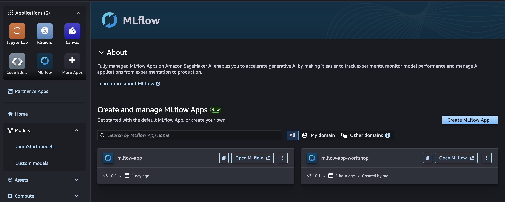

2. `mlflow-app-workshop` という名前の MLflow App を選択する

   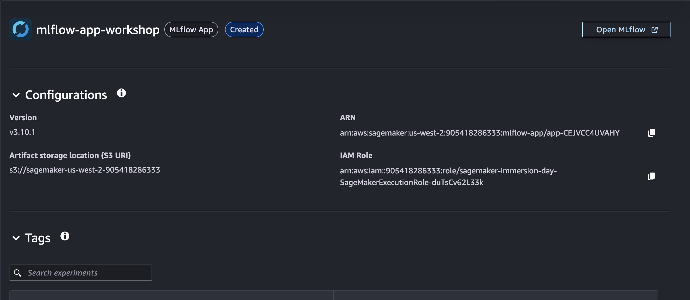

3. **Open MLflow** を選択して MLflow app（MLflow UI）を開く

   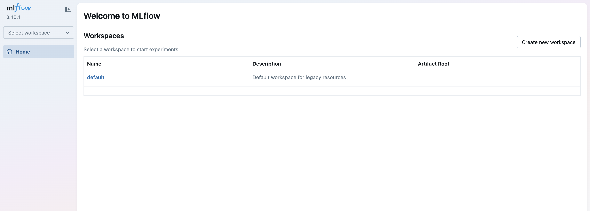

4. MLflow UI 内で `default` の **Workspaces** を選択すると、エクスペリメントの一覧が表示される

   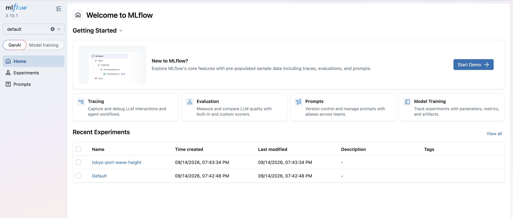

5. `tokyo-port-wave-height` という名前のエクスペリメントを選択し、**Training runs** を選択すると、`run-a-shallow` と `run-b-deep` という 2 つの実行が、パラメータ・指標・成果物とともに並んで表示されることを確認する

   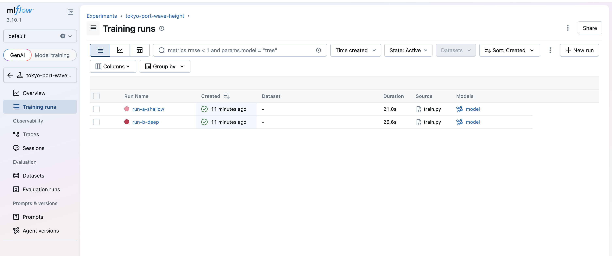

6. 2 つの実行にチェックを入れると、**Model metrics** の比較チャートが表示される

| タブ | 確認できること |
|---|---|
| **Parameters** | `max_depth`、`eta` などのハイパーパラメータの違い |
| **Metrics** | `rmse`、`mae`、`r2`。2 つの実行を選択して **Compare** すると、指標の差がグラフで見られる |
| **Artifacts** | 学習済みモデルの成果物 |

### Model metrics の各項目について

**Model metrics** に表示される 7 つの指標は、それぞれ次を示しています。

| 指標 | 意味 | どこで記録されるか |
|---|---|---|
| `rmse` | 検証データに対する二乗平均平方根誤差（m 単位）。値が小さいほど精度が良い | `train.py` 内で `mean_squared_error(y_val, y_pred) ** 0.5` を計算し、`mlflow.log_metrics()` で明示的に記録 |
| `mae` | 検証データに対する平均絶対誤差（m 単位） | 同上（`mean_absolute_error`） |
| `r2` | 決定係数。1 に近いほど当てはまりが良く、0 は「平均値で予測するのと同程度」 | 同上（`r2_score`） |
| `best_iteration` | 早期終了（early stopping）で「検証精度が最も良かった」ブースティングラウンド数 | `mlflow.xgboost.autolog()` が XGBoost の学習過程から自動記録 |
| `stopped_iteration` | 実際に学習が停止したラウンド数（`best_iteration` ＋ `early_stopping_rounds` 分の様子見が終わった時点） | 同上（autolog） |
| `train-rmse`（折れ線） | 各ラウンドごとの **学習データ** に対する RMSE の推移（学習曲線） | `xgb.train()` の `evals=[(dtrain, "train"), ...]` から自動記録 |
| `validation-rmse`（折れ線） | 各ラウンドごとの **検証データ** に対する RMSE の推移。この値の下がり方を見て早期終了が判断される | 同上（`evals` の `"validation"` 側） |

`rmse`/`mae`/`r2` は「学習完了後の最終スコア」を示す 1 つの値、`train-rmse`/`validation-rmse` の折れ線は「学習が進むにつれてどう収束したか」の過程を示します。`eta`（学習率）が大きい `run-a-shallow` の方が、少ないラウンド数で `best_iteration` に達する傾向があります。

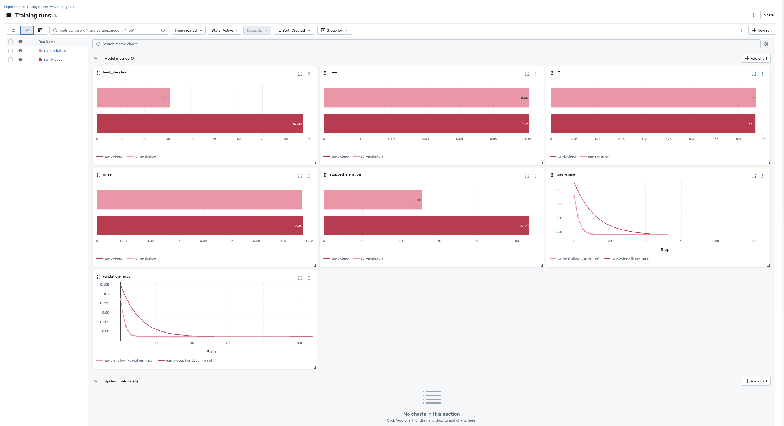

### System metrics の各項目について

`scripts/train.py` では `mlflow.start_run(log_system_metrics=True)` を指定しており、学習ジョブを実行しているインスタンスのリソース使用状況も **System metrics** セクションに自動収集・記録されます（`psutil` を `scripts/requirements.txt` に追加）。いずれも `system/` というプレフィックス付きで記録されます。

| 指標 | 意味 |
|---|---|
| `system/cpu_utilization_percentage` | CPU 使用率（%） |
| `system/system_memory_usage_megabytes` | メモリ使用量（MB） |
| `system/system_memory_usage_percentage` | メモリ使用率（%） |
| `system/disk_usage_megabytes` | ディスク使用量（MB） |
| `system/disk_usage_percentage` | ディスク使用率（%） |
| `system/disk_available_megabytes` | ディスク空き容量（MB） |
| `system/network_receive_megabytes` | ネットワーク受信量（MB） |
| `system/network_transmit_megabytes` | ネットワーク送信量（MB） |
| `system/gpu_utilization_percentage` | GPU 使用率（%）※GPU インスタンスの場合のみ |
| `system/gpu_memory_usage_megabytes` | GPU メモリ使用量（MB）※同上 |
| `system/gpu_memory_usage_percentage` | GPU メモリ使用率（%）※同上 |
| `system/gpu_power_usage_watts` | GPU 消費電力（W）※同上 |

本ワークショップの学習インスタンス（`ml.m5.xlarge`）は CPU のみのため、GPU 系の指標は記録されません。

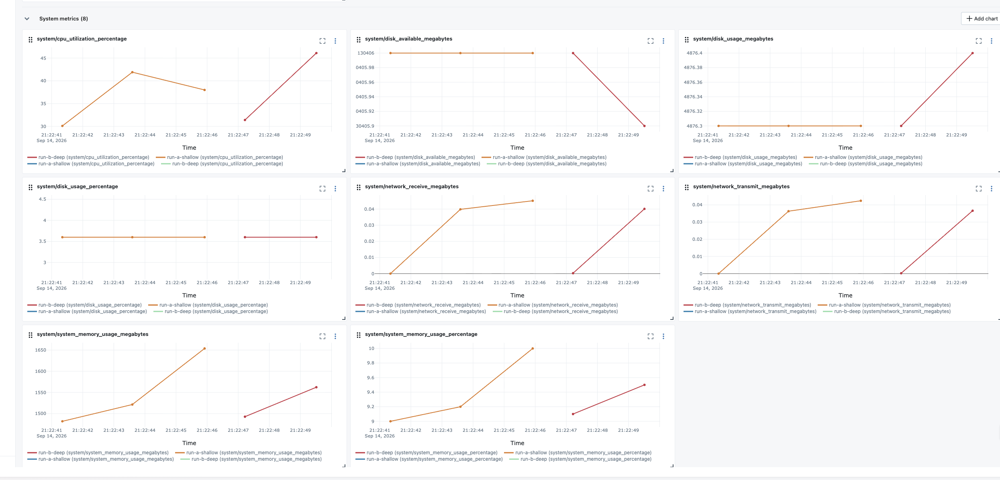

### (2) コードから最良の実行を選ぶ

MLflow UI の代わりに、`mlflow.search_runs()` を使ってプログラム的に最良の実行を選ぶこともできます。`workshop.ipynb` に戻り、以下のセルを実行してください。

```python
# 実験に記録された全実行を RMSE の昇順（良い順）で取得する
runs_df = mlflow.search_runs(
    experiment_names=[mlflow_experiment_name],
    order_by=["metrics.rmse ASC"],
)
# 表示する列を、実行名とハイパーパラメータ・指標に絞り込む
display_columns = [
    c for c in runs_df.columns
    if c in ("tags.mlflow.runName", "metrics.rmse", "metrics.mae", "metrics.r2")
    or c.startswith("params.max_depth") or c.startswith("params.eta")
]
runs_df[display_columns].head(5)
```

RMSE の昇順で実行が並びます。`run-a-shallow`（浅い木）と `run-b-deep`（深い木）で、どちらの精度が良いかを確認してください。

```python
# RMSE が最小の実行を「最良モデル」として選ぶ
best_run = runs_df.iloc[0]
best_run_name = best_run["tags.mlflow.runName"]
best_run_id = best_run["run_id"]

print(f"最良の実行: {best_run_name}")
print(f"  RMSE = {best_run['metrics.rmse']:.4f}")
print(f"  MAE  = {best_run['metrics.mae']:.4f}")
print(f"  R2   = {best_run['metrics.r2']:.4f}")

# best_run_name（'run-a-shallow' or 'run-b-deep'）に対応する ModelTrainer を選ぶ
best_trainer = trainers[best_run_name]
best_training_job_name = training_job_names[best_run_name]
```

これで `best_trainer` が確定しました。

> ⚠️ **`KeyError` や `IndexError` が出る場合**: 学習ジョブがまだ完了していないため、MLflow にまだ実行が記録されていない可能性があります。1 分ほど待ってから `runs_df = mlflow.search_runs(...)` のセルを再実行してください。

### 最良モデルを Model Registry に登録する

> ℹ️ **SageMaker Model Registry とは**: 学習済みモデルをバージョン管理するためのカタログです。同じ名前（モデルパッケージグループ）に対して `v1`、`v2`... と履歴が積み重なるので、「どのモデルが今の本番モデルか」を後から追跡できます。SageMaker Managed MLflow は、MLflow に記録したモデルを、この Model Registry に直接登録する機能（`mlflow.register_model()`）を提供しています（セクション 2.0 で `ModelRegistrationMode="AutoModelRegistrationEnabled"` を指定した MLflow App であれば、SageMaker Model Registry と連携する形で登録されます）。

`best_run`（最良の実行）が学習時に記録したモデルを、`wave-height-xgboost` という名前で Model Registry に登録します。初めて登録するときは自動的に **v1** が作られ、同じ名前で再登録すると v2, v3, ... と履歴が積み重なります。

```python
# best_run が記録したロギング済みモデル（Logged Model）を取得する
best_logged_models = mlflow.MlflowClient().search_logged_models(
    experiment_ids=[best_run["experiment_id"]],
    filter_string=f"source_run_id='{best_run_id}'",
)
if not best_logged_models:
    raise RuntimeError(f"run_id={best_run_id} に紐づくロギング済みモデルが見つかりません")
best_logged_model = best_logged_models[0]
print(f"登録対象のモデル: {best_logged_model.model_uri}")

# Model Registry に登録する（初回は v1 が自動的に作られる）
registered_model_name = "wave-height-xgboost"
model_version = mlflow.register_model(best_logged_model.model_uri, registered_model_name)

print(f"モデル名   : {model_version.name}")
print(f"バージョン : v{model_version.version}")
print(f"登録元の実行: {best_run_name} (run_id={best_run_id})")
```

MLflow UI（[2.3 (1) MLflow UI で比較する](#1-mlflow-ui-で比較する) と同じ画面）の **Models** タブから、`wave-height-xgboost` という名前で登録されたモデルと、そのバージョン（`v1`）を確認できます。

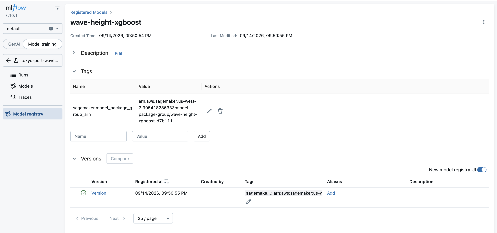

**[2.4 デプロイ](#24-デプロイdata-capture-有効ノートブック-セクション-4) に進み**、この `best_trainer` を使ってデプロイを進めてください。

## 2.4 デプロイ（Data Capture 有効）（ノートブック セクション 4）

> ℹ️ この節に進む前に、[2.3 MLflow による実行比較](#23-mlflow-による実行比較ノートブック-セクション-3) の手順で `best_trainer` を確定させてください。

最良モデルをリアルタイムエンドポイントとしてデプロイします。**Data Capture を有効化**しておくことで、このエンドポイントを [3. モニタリング](#3-モニタリングドリフト検知ノートブック-セクション-6) でそのまま使い回せます。

### (1) 推論スクリプトを確認する

`inference/inference.py` は `model_fn` のみを定義しています。

```python
!pygmentize inference/inference.py
```

SageMaker 組み込みの XGBoost 推論コンテナが、CSV（ヘッダーなし）の入力を DMatrix に変換し、`predict()` を呼び、結果をテキストで返す処理を代行してくれます。そのため `input_fn` / `predict_fn` / `output_fn` を自分で書く必要がありません。

### (2) モデル成果物に推論コードを同梱する（repack）

> ℹ️ **repack とは**: SageMaker の学習ジョブが出力するモデル成果物（`model.tar.gz`）には、学習済みモデルの重みだけが入っており、推論時にどう処理するか（`inference.py`）は含まれていません。`repack_model` は、この `model.tar.gz` を展開し、推論コードを `code/` サブディレクトリに追加してから、再度 `model.tar.gz` として固め直すユーティリティです。

> ℹ️ **なぜ今回 repack が必要なのか**: repack は SageMaker 利用時に常に必須の手順ではなく、**「`ModelTrainer` で学習し、`ModelBuilder` でデプロイする」という今回選んだ組み合わせに特有の一手間**です。`ModelBuilder` は S3 上の `model.tar.gz` の**パスだけ**を受け取る作りになっているため、その中に推論コードがあらかじめ入っていないと、カスタムの `model_fn`（推論スクリプト）を使うデプロイができません。`ModelTrainer` は学習コードだけをコンテナに送る仕組みなので、学習が終わった時点の `model.tar.gz` には推論コードが含まれておらず、`ModelBuilder` に渡す前に repack で追加する必要があります。
>
> **repack が不要になるケース**: 次のような場合は repack を省略できます。
> - **推論コンテナの既定処理で十分な場合**: そもそもカスタムの `model_fn` 等が不要（モデルファイル名が既定のままで読み込める）なら、推論コードを同梱する必要自体がなくなります。
> - **`model_data` と `entry_point` を別々に指定できるデプロイ方法を使う場合**: 例えば `sagemaker.xgboost.model.XGBoostModel` のようなフレームワークモデルクラスは、学習成果物の S3 パス（`model_data`）と推論スクリプト（`entry_point`、`source_dir`）を別々の引数として受け取れるため、`model.tar.gz` を書き換える必要がありません。今回 `ModelBuilder` を使っているのは、モダンな SageMaker SDK の書き方を体験してもらう狙いのためで、`XGBoostModel` 等を使えば repack のステップ自体を無くすこともできます。
> - **学習と推論のコードを最初から1つのコンテナに含めている場合**（自作 Docker イメージ等）: 「後から追加する」という工程自体が発生しません。
> - **学習→デプロイを一気通貫で行う場合（同一インスタンスから `fit()` → `deploy()`）**: 従来の `Estimator`（v2 SDK）のように、学習に使った同じオブジェクトから続けて `deploy()` を呼ぶ場合、SDK は学習時に指定した `entry_point`/`source_dir` を覚えているため、利用者が明示的に `repack_model()` を呼ぶ必要がありません。ただし内部的には、推論コードは `model.tar.gz` に埋め込まれるとは限らず、`sourcedir.tar.gz` という別ファイルとして S3 に運ばれる場合もあります。「学習時にすでに成果物へ含まれている」という理解よりも、「コードの受け渡しを SDK が裏側で自動処理してくれるため、利用者側の明示的な repack 操作が不要になる」というのが実際の仕組みです。今回はデータ準備（Processing ジョブ）と学習（`ModelTrainer`）を分けており、かつデプロイは `ModelBuilder` という別クラスで行うため、この自動処理の対象外になり、repack が必要になっています。

`ModelTrainer` は学習コードだけをコンテナに送るため、推論に使う `inference.py` は成果物へ後から追加（repack）する必要があります。

```python
from sagemaker.core.utils import repack_model

# 最良の学習ジョブが出力したモデル成果物（model.tar.gz）の S3 パスを取得する
model_data_s3 = best_trainer._latest_training_job.refresh().model_artifacts.s3_model_artifacts

# 推論コード（inference.py）をモデル成果物に同梱し直す
# （XGBoost の組み込み推論コンテナは、model.tar.gz 内の code/ ディレクトリに
#  推論スクリプトがあることを期待するため）
repacked_model_s3 = f"s3://{bucket}/{prefix}/model/repacked/model.tar.gz"
repack_model(
    inference_script="inference.py",
    source_directory="inference",
    dependencies=[],
    model_uri=model_data_s3,
    repacked_model_uri=repacked_model_s3,
    sagemaker_session=session,
)
```

### (3) `ModelBuilder` でモデルをビルドし、Data Capture 有効でデプロイする

`ModelBuilder` は学習済みモデルをパッケージ化し、`build() → deploy()` でデプロイします。`DataCaptureConfig` を渡すことで、すべてのリクエスト・レスポンスが JSONL として S3 に記録されます。

> ℹ️ **リアルタイムエンドポイントとは**: 学習済みモデルを常時起動のWeb API として公開する SageMaker の仕組みです。デプロイすると HTTPS 経由でいつでも推論をリクエストできるようになります（バッチ処理でまとめて予測する「バッチ推論」とは異なり、1 件ずつすぐに結果が返る点が特徴です）。`ModelBuilder` は、学習済みモデルとコンテナイメージから、このエンドポイントを作るための「モデル」リソースを組み立てるモダンな SageMaker SDK のクラスです。
>
> ℹ️ **Data Capture とは**: リアルタイムエンドポイントに標準搭載されている機能で、推論リクエスト（入力）とレスポンス（予測結果）をそのまま S3 に自動保存します。エンドポイント自体には手を加えず「横から」記録するイメージです。本番運用中の推論結果を後から分析する（今回であればモデルの劣化やデータドリフトを検知する）ために使います。設定は `sampling_percentage`（何 % のリクエストを記録するか）と `destination_s3_uri`（保存先）が中心です。

```python
from sagemaker.serve.model_builder import ModelBuilder
from sagemaker.serve.builder.schema_builder import SchemaBuilder
from sagemaker.core.model_monitor import DataCaptureConfig
from pydantic import ValidationError

# --- ① 環境（コンテナイメージ）: AWS 提供の組み込み XGBoost 推論コンテナを取得する ---
# ここには「XGBoost を動かすための実行環境」（Python・xgboost 本体・依存ライブラリ）
# だけが入っている。学習用イメージ（framework="xgboost", version="3.0-5"）とは
# image_scope が異なる（学習用 vs 推論用）点に注意。
inference_image = image_uris.retrieve(framework="xgboost", region=region, version="3.0-5", image_scope="inference")

# ModelBuilder でモデル（SageMaker Model リソース）を組み立てる
# SchemaBuilder に入出力サンプルを渡すことで、シリアライザ/デシリアライザが自動設定される
model_builder = ModelBuilder(
    schema_builder=SchemaBuilder(sample_input="5.0,-0.5,0.87,6", sample_output="0.21"),
    # ① 環境: 上で取得した組み込みコンテナイメージ
    image_uri=inference_image,
    # ② モデルの重み＋推論コード: repack_model で作った model.tar.gz
    #    （学習済みモデルの重みと、inference.py の model_fn の両方がこの中に入っている）
    s3_model_data_url=repacked_model_s3,
    role_arn=role,
    sagemaker_session=session,
    instance_type="ml.m5.xlarge",
)
# build() の時点で「① 環境」と「② モデル＋推論コード」が組み合わされ、
# SageMaker の Model リソースが作られる（まだエンドポイントは起動しない）。
built_model = model_builder.build()

# --- Data Capture を有効化する設定を作る ---
# enable_capture=True がこの設定の本体。これを deploy() に渡すことで、
# エンドポイントへの全リクエスト・レスポンスが destination_s3_uri に JSONL で保存される。
# ここではまだ「設定を作っただけ」で、実際に有効になるのは次の deploy() 呼び出し時。
capture_s3_uri = f"s3://{bucket}/{prefix}/data-capture"
data_capture_config = DataCaptureConfig(
    enable_capture=True,
    sampling_percentage=100,
    destination_s3_uri=capture_s3_uri,
    capture_options=["Input", "Output"],
    csv_content_types=["text/csv"],
)

# --- deploy() でリアルタイムエンドポイントを起動する ---
# instance_type / initial_instance_count を指定して deploy() を呼ぶこと自体が、
# 「常時起動のインスタンス上でリクエストが来るたびに即座に応答する」リアルタイム
# エンドポイントを作る指定になる（バッチ変換や非同期推論とは別の呼び出し方）。
# data_capture_config=data_capture_config を渡すことで、上で作った Data Capture の
# 設定がこのエンドポイントに実際に適用される。
try:
    endpoint = model_builder.deploy(
        instance_type="ml.m5.xlarge",
        initial_instance_count=1,
        data_capture_config=data_capture_config,
        wait=False,
    )
except ValidationError:
    # 既知の SDK の挙動: data_capture_config 指定時に kms_key_id を省略すると
    # デプロイ完了後のレスポンス解析で ValidationError が出るが、エンドポイント
    # 作成リクエスト自体は既に送信されているため無視して進める。
    pass

endpoint_name = model_builder.endpoint_name
```

> ⚠️ **`ValidationError` が表示されても異常ではありません。** これは SDK の既知の挙動で、エンドポイント作成リクエスト自体は成功しています。`endpoint_name` が表示されていれば問題ありません。

**このセルも `wait=False` で投入します。**

> ⏱️ 所要時間の目安: 5〜7 分

次のセルでエンドポイントの起動をポーリングします（`boto3` を直接使い、上記の既知の挙動を避けます）。

```python
# エンドポイントが InService になるまでポーリングする
# （上記の既知の挙動を避けるため、SDK の Endpoint リソースではなく boto3 を直接使う）
terminal_states = {"InService", "Failed"}
while True:
    desc = sm_client.describe_endpoint(EndpointName=endpoint_name)
    status = desc["EndpointStatus"]
    print(f"  status={status}")
    if status in terminal_states:
        break
    time.sleep(30)
```

`status=InService` と表示されれば成功です。

## 2.5 推論確認（ノートブック セクション 5）

検証データから数件をエンドポイントに送り、推論結果を確認します。

```python
from sagemaker.core.s3 import S3Downloader

# 推論エンドポイント呼び出し用の boto3 クライアント
runtime_client = boto_session.client("sagemaker-runtime", region_name=region)

# 前処理済みの検証データ（特徴量とラベル）をローカルにダウンロードする
os.makedirs("data/validation", exist_ok=True)
S3Downloader.download(f"{validation_data_s3}val_features.csv", "data/validation")
S3Downloader.download(f"{validation_data_s3}val_labels.csv", "data/validation")

val_features = pd.read_csv("data/validation/val_features.csv", header=None,
                            names=["wind_speed", "wind_sin", "wind_cos", "month"])
val_labels = pd.read_csv("data/validation/val_labels.csv", header=None, names=["wave_height"])
```

```python
# 検証データの先頭 20 件をエンドポイントに送り、予測値と実際の値を比較する
SAMPLE_COUNT = 20
sample = val_features.head(SAMPLE_COUNT)
sample_labels = val_labels.head(SAMPLE_COUNT)

predictions = []
actuals = []
for i, row in sample.iterrows():
    # CSV（ヘッダーなし、1 行）としてリクエストボディを組み立てる
    payload = ",".join(str(v) for v in row.values)
    response = runtime_client.invoke_endpoint(
        EndpointName=endpoint_name, ContentType="text/csv", Body=payload,
    )
    prediction = float(response["Body"].read().decode("utf-8").strip())
    actual = float(sample_labels.loc[i, "wave_height"])
    predictions.append(prediction)
    actuals.append(actual)
    print(f"予測: {prediction:.3f} m   実際: {actual:.3f} m")
```

予測値と実際の値が近い範囲（東京港の波高は概ね 0.04〜1.26m の範囲）に収まっていることを確認してください。**同時刻の風だけで完全には当てられない**（R² は概ね 0.4〜0.5 程度）ため、多少のズレは正常です。

予測値と実際の値をグラフでも比較します。2 種類のグラフを並べて描きます。左は「予測」「実際」の 2 本のバーをサンプルごとに並べるグループ化バーチャート（個々の値の大小を見るのに向く）、右は X 軸に実際の値・Y 軸に予測値をとった散布図に対角線（y = x、予測が完全に正解と一致するライン）を重ねたもの（相関の強さや過大/過小予測の傾向を見るのに向く）です。

```python
import matplotlib.pyplot as plt
import numpy as np

# グラフのラベルは英語表記にする（SageMaker Distribution のデフォルト環境には
# 日本語フォントが入っておらず、日本語ラベルは文字化け（□表示）するため）
fig, (ax_bar, ax_scatter) = plt.subplots(1, 2, figsize=(13, 5))

# --- 左: サンプルごとに「予測」「実際」の 2 本のバーを並べて比較する ---
sample_labels_display = [f"#{i+1}" for i in range(len(predictions))]
x = np.arange(len(predictions))
bar_width = 0.35

ax_bar.bar(x - bar_width / 2, predictions, bar_width, label="Predicted", color="#1f77b4")
ax_bar.bar(x + bar_width / 2, actuals, bar_width, label="Actual", color="#ff7f0e")
ax_bar.set_xlabel("Validation sample")
ax_bar.set_ylabel("Significant wave height (m)")
ax_bar.set_title("Predicted vs. actual (per sample)")
ax_bar.set_xticks(x)
ax_bar.set_xticklabels(sample_labels_display, rotation=45 if len(predictions) > 10 else 0)
ax_bar.legend()
ax_bar.grid(axis="y", linestyle="--", alpha=0.5)

# --- 右: 散布図（実際 vs 予測）と y = x の対角線を重ねて描く ---
# 対角線（y = x）: 予測が実際の値と完全に一致する場合のライン。
# 点がこの線に近いほど精度が高く、線より上なら過大予測、下なら過小予測を示す。
ax_scatter.scatter(actuals, predictions, color="#1f77b4", label="Validation sample")
min_value = min(min(actuals), min(predictions))
max_value = max(max(actuals), max(predictions))
ax_scatter.plot(
    [min_value, max_value], [min_value, max_value],
    linestyle="--", color="gray", label="y = x (perfect prediction)",
)
ax_scatter.set_xlabel("Actual significant wave height (m)")
ax_scatter.set_ylabel("Predicted significant wave height (m)")
ax_scatter.set_title("Predicted vs. actual (scatter)")
ax_scatter.legend()
ax_scatter.grid(linestyle="--", alpha=0.5)
ax_scatter.set_aspect("equal", adjustable="box")

plt.tight_layout()
plt.show()
```

エンドポイントの `InService` を確認できたら、[3. モニタリング](#3-モニタリングドリフト検知ノートブック-セクション-6) に進み、このエンドポイントを使ってドリフト検知を行います。

---

# 3. モニタリング（ドリフト検知）（ノートブック セクション 6）

対応するノートブック: `workshop.ipynb` セクション 6

デプロイ済みのエンドポイントに対して、**正常系（2024 年 1〜8 月）**と**異常系（2025 年 10〜12 月）**の 2 つの期間のデータを投入し、データドリフトとモデル精度の劣化を [Evidently](https://www.evidentlyai.com/) で検知します。

> ℹ️ **Evidently とは**: モデル監視・データ品質評価のためのオープンソースライブラリです。「本番投入後のデータが、学習時のデータと比べてどれだけ変化したか（データドリフト）」や「予測精度がどれだけ劣化したか（モデル品質）」を計算し、HTML レポートとして可視化してくれます。ここでは 2 種類のレポート（`DataDriftPreset`＝入力データの分布変化、`RegressionPreset`＝予測精度）を使います。

> ℹ️ **データドリフトとは**: 本番環境に入ってくるデータの傾向（分布）が、モデルを学習させたときのデータの傾向から変化してしまう現象です。今回の例では「風向・風速の傾向が学習時と変わる」ことがデータドリフトに相当します。データドリフトが起きると、モデルが未知のパターンに対して予測することになり、精度が劣化しやすくなります。

> ℹ️ **出力（予測結果）側の異常も検知できます**: `DataDriftPreset` が見るのは入力（`wind_speed` 等）の分布変化ですが、`RegressionPreset` は「予測値」と「実際の正解ラベル（`wave_height`）」を突き合わせて RMSE・R² 等を計算するため、**入力の分布はさほど変わらないのに、出力の精度だけが劣化する**ケースも検知できます。今回のシナリオはまさにこのパターンです（異常系は入力側のドリフトは小さめですが、`wave_height` の分布が大きく変化しているため、予測精度の劣化として明確に検知されます）。「入力データの監視だけでは不十分で、モデル品質の監視も併用する必要がある」という実務上の教訓を体験できます。

> ℹ️ 目安時間: 15〜20 分
>
> ⚠️ **[2.4 デプロイ](#24-デプロイdata-capture-有効ノートブック-セクション-4) でエンドポイントが `InService` になっていることを確認してから進めてください。**

## なぜ 2 つの期間を比較するのか

| 期間 | 想定される結果 |
|---|---|
| **正常系**（2024 年 1〜8 月） | ベースライン（学習データ、2021〜2023 年）と分布がほとんど変わらない期間。モデルの精度は保たれているはず |
| **異常系**（2025 年 10〜12 月） | 波高の分布が大きく変化した期間。同じモデルでの精度が大きく落ちるはず |

2 つを比較することで、「ドリフトが無い場合／ある場合をモデルが判別できている」ことを確認します。片方だけでは「アラートが出た」で終わりますが、両方を見ることでモニタリングの意義が伝わります。

> ℹ️ 本ワークショップは**回帰**タスクのため、モデル品質評価には Evidently の `RegressionPreset` を使います。

## 3.1 正常系・異常系のデータを切り出す

学習には使っていない期間のデータを、`workshop.ipynb` のセクション 1 で生成した `observation_df` から切り出し、風向・風速からモデルへの入力を組み立てます。

> ℹ️ **異常データ（ドリフト）の作り方**: 異常系データは「別のデータを用意する」のではなく、`generate_synthetic_data.py` が擬似データを生成する時点で、**特定の期間（2025 年 10〜12 月）だけ波高が下がるように仕込んで**います。具体的には、風速や季節性から計算した波高に対して、通常期間は概ね `1.0` 前後のスケール（`YEAR_WAVE_SCALE`）を掛けるところを、2025 年 10〜12 月だけ `0.62`（`DRIFT_PERIOD["wave_scale"]`）という小さいスケールを掛けています。つまり、**同じ風向・風速の入力に対して、波高だけが不自然に低くなる**期間を作り、モデルが学習していないパターンを再現しています。
>
> 異常系は「2025 年 10〜12 月」という季節が限定された期間でもあるため、月ごとの風向パターンの違いから **入力側（風向・風速）の分布もある程度変化**します。そこに加えて波高スケールを直接下げているため、「入力の分布が変わる（データドリフト）」と「入出力の関係が崩れる（モデル劣化）」の両方が同時に起こる期間になっています。これにより、正常系（2024 年 1〜8 月、学習時と近い関係性）と異常系（2025 年 10〜12 月）を比較すると、実務でよくある「季節変化とモデル劣化が重なって起きる」パターンを再現できます。

```python
# 16 方位の風向名を角度（度）に変換するための対応表
DIRECTIONS_16 = ["N", "NNE", "NE", "ENE", "E", "ESE", "SE", "SSE",
                 "S", "SSW", "SW", "WSW", "W", "WNW", "NW", "NNW"]
DIR_TO_DEGREE = {name: index * 22.5 for index, name in enumerate(DIRECTIONS_16)}

def build_features(frame):
    """生の観測データから推論用の特徴量（sin/cos 変換済み風向・月）を作る。"""
    # 欠測行を除外する（学習時の前処理と同じ考え方）
    frame = frame.dropna(subset=["wind_dir", "wind_speed", "wave_height"]).copy()
    frame = frame[frame["wind_dir"].isin(DIR_TO_DEGREE)]
    # 風向を周期特徴（sin/cos）に変換する
    degrees = frame["wind_dir"].map(DIR_TO_DEGREE)
    frame["wind_sin"] = np.sin(np.radians(degrees))
    frame["wind_cos"] = np.cos(np.radians(degrees))
    frame["month"] = frame["timestamp"].dt.month.astype("float64")
    return frame

FEATURE_COLUMNS = ["wind_speed", "wind_sin", "wind_cos", "month"]

# 正常系: ベースラインと分布がほとんど変わらない期間
normal_period = observation_df[
    (observation_df["timestamp"] >= "2024-01-01") & (observation_df["timestamp"] <= "2024-08-31")
]
# 異常系: 波高の分布が大きく変化した期間（強いドリフトを想定）
anomaly_period = observation_df[
    (observation_df["timestamp"] >= "2025-10-01") & (observation_df["timestamp"] <= "2025-12-31")
]
normal_features = build_features(normal_period)
anomaly_features = build_features(anomaly_period)
```

### 正常系・異常系の統計量を比較する

エンドポイントに投入する前に、切り出した 2 つの期間で入力（`wind_speed` 等）と、後で答え合わせに使う正解ラベル（`wave_height`）の統計量がどう違うかを確認します。

> ℹ️ **`wave_height` は推論の入力ではありません**。エンドポイントに送るのは `FEATURE_COLUMNS`（`wind_speed`, `wind_sin`, `wind_cos`, `month`）だけで、`wave_height` は推論には一切使いません。ここで `wave_height` の統計量も見ているのは、[3.6 モデル品質を評価する](#36-モデル品質を評価するregressionpreset) で「予測値と正解ラベルを突き合わせて精度を測る」ときの、その正解ラベル自体の分布が、正常系・異常系でどれだけ変わっているかを事前に確認しておくためです。

```python
# 正常系・異常系それぞれの統計量（平均・標準偏差・最小最大）を並べて比較する
compare_columns = FEATURE_COLUMNS + ["wave_height"]

normal_stats = normal_features[compare_columns].describe().loc[["mean", "std", "min", "max"]]
anomaly_stats = anomaly_features[compare_columns].describe().loc[["mean", "std", "min", "max"]]

comparison_df = pd.concat(
    {"normal (2024/1-8)": normal_stats, "anomaly (2025/10-12)": anomaly_stats},
    axis=0,
)

# ここで比較しているのは 2 種類の性質が異なる列:
#   - wind_speed / wind_sin / wind_cos / month: 推論の入力（このワークショップの
#     DataDriftPreset が実際に監視する対象）。季節の違い（冬 vs 秋）程度の変化はあるが、
#     wave_height ほど極端な差にはならないはず。
#   - wave_height: 推論には使わない正解ラベル（モデル品質評価の答え合わせ専用）。
#     generate_synthetic_data.py の DRIFT_PERIOD["wave_scale"] = 0.62 により、
#     2025 年 10〜12 月だけ波高に 0.62 倍のスケールを掛けているため、
#     異常系の wave_height 平均は正常系の平均の概ね 6 割程度になる想定。
#     つまり「モデルが予測すべき正解の分布自体が変化した」ことを事前に示している。
comparison_df
```

## 3.2 エンドポイントに投入する

各期間のデータをエンドポイントに送り、一意の推論 ID（`InferenceId`）を付けます。Data Capture が入力・出力を S3 に記録します。

```python
def invoke_and_capture(features_df, label_prefix):
    """features_df の各行をエンドポイントに送信する（Data Capture に記録される）。"""
    for idx, (_, row) in enumerate(features_df.iterrows()):
        # InferenceId を付けておくことで、後で Data Capture のログと期間（正常/異常）を対応付けられる
        inference_id = f"{label_prefix}-{idx:06d}"
        payload = ",".join(str(v) for v in row[FEATURE_COLUMNS].values)
        response = runtime_client.invoke_endpoint(
            EndpointName=endpoint_name, ContentType="text/csv",
            Body=payload, InferenceId=inference_id,
        )
        response["Body"].read()  # レスポンスを読み切る

# サンプリングして送信する（全件送ると時間がかかるため、各期間 500 件程度に絞る）
SAMPLE_SIZE = 500
normal_sample = normal_features.sample(min(SAMPLE_SIZE, len(normal_features)), random_state=42)
anomaly_sample = anomaly_features.sample(min(SAMPLE_SIZE, len(anomaly_features)), random_state=42)

# 送信開始前の時刻を記録しておく（このセクションより前の古い Data Capture ファイルを
# 誤って対象に含めないため。エンドポイントが過去にテスト呼び出しされていた場合、
# S3 には既にキャプチャファイルが存在していることがある）
from datetime import timezone
capture_start_time = datetime.now(timezone.utc)

# 正常系・異常系それぞれをエンドポイントに送信する
invoke_and_capture(normal_sample, "normal")
invoke_and_capture(anomaly_sample, "anomaly")
```

各期間 500 件、合計 1,000 件のリクエストを送信します。数十秒かかります。

## 3.3 Data Capture の内容を読み込む

エンドポイント呼び出しから S3 にキャプチャファイルが現れるまで、1〜2 分の遅延があります。

> ⚠️ **推論確認セクション（2.5）で既にエンドポイントを呼び出した場合の注意**: Data Capture はエンドポイントへの全リクエストを記録するため、S3 には推論確認セクションでの呼び出し分のキャプチャファイルも既に存在しています。単に「1 つでもファイルが見つかったら完了」と判定すると、今回投入した 1,000 件分がまだ届く前に処理を進めてしまい、`captured_df` の `period` 列が空になる（`InferenceId` が空文字のレコードしか取得できていない）ことがあります。そのため、`capture_start_time` より後に更新されたファイルだけを対象にし、**ファイルの個数ではなく実際のレコード数**（送信した件数の 8 割程度に達したか）で完了を判定します（Data Capture は複数リクエストを 1 ファイルにまとめて書き出すことがあるため、ファイル数だけでは十分届いたかどうか判断できません）。

```python
s3_client = boto_session.client("s3")
capture_prefix = f"{prefix}/data-capture/{endpoint_name}/AllTraffic"

def list_new_capture_keys():
    """capture_start_time より後に更新された（今回の送信で作られた）キャプチャファイルだけを返す。"""
    resp = s3_client.list_objects_v2(Bucket=bucket, Prefix=capture_prefix)
    return [
        obj["Key"]
        for obj in resp.get("Contents", [])
        if obj["LastModified"] >= capture_start_time
    ]

def count_records(keys):
    """キャプチャファイル群に含まれる正常系・異常系のレコード数を数える。"""
    normal_count = 0
    anomaly_count = 0
    for key in keys:
        obj = s3_client.get_object(Bucket=bucket, Key=key)
        for line in obj["Body"].read().decode("utf-8").strip().split("\n"):
            if not line:
                continue
            inference_id = json.loads(line).get("eventMetadata", {}).get("inferenceId", "")
            if inference_id.startswith("normal-"):
                normal_count += 1
            elif inference_id.startswith("anomaly-"):
                anomaly_count += 1
    return normal_count, anomaly_count

# 送信した件数の 8 割程度に達するまで待つ（サンプリングなどで多少ズレることがあるため）
EXPECTED_NORMAL = len(normal_sample)
EXPECTED_ANOMALY = len(anomaly_sample)
THRESHOLD = 0.8

print("Data Capture ファイルの到着を待っています（最大 10 分）...")
for attempt in range(40):
    capture_keys = list_new_capture_keys()
    normal_count, anomaly_count = count_records(capture_keys)
    print(
        f"  ファイル数: {len(capture_keys)}"
        f" | normal: {normal_count}/{EXPECTED_NORMAL}"
        f" | anomaly: {anomaly_count}/{EXPECTED_ANOMALY}"
    )
    if (
        normal_count >= EXPECTED_NORMAL * THRESHOLD
        and anomaly_count >= EXPECTED_ANOMALY * THRESHOLD
    ):
        print("十分な件数が届きました。")
        break
    time.sleep(15)
else:
    print("まだ十分な件数が届いていません。もう少し待ってから、このセルを再実行してください。")

capture_keys = list_new_capture_keys()
print(f"キャプチャファイル数（今回の送信分のみ）: {len(capture_keys)}")
```

Data Capture が記録した JSONL ファイルをパースし、`captured_df` にまとめます。

```python
def parse_capture_files(keys):
    """Data Capture の JSONL ファイルを読み込み、DataFrame にする。"""
    records = []
    for key in keys:
        obj = s3_client.get_object(Bucket=bucket, Key=key)
        # Data Capture は 1 行 1 リクエスト/レスポンスの JSON Lines 形式
        for line in obj["Body"].read().decode("utf-8").strip().split("\n"):
            record = json.loads(line)
            inference_id = record.get("eventMetadata", {}).get("inferenceId", "")
            input_data = record.get("captureData", {}).get("endpointInput", {})
            output_data = record.get("captureData", {}).get("endpointOutput", {})
            # 入出力データは Base64 エンコードされている場合があるのでデコードする
            raw_input = input_data.get("data", "")
            if input_data.get("encoding") == "BASE64":
                raw_input = base64.b64decode(raw_input).decode("utf-8")
            raw_output = output_data.get("data", "")
            if output_data.get("encoding") == "BASE64":
                raw_output = base64.b64decode(raw_output).decode("utf-8")
            records.append({
                "inference_id": inference_id, "input": raw_input.strip(),
                "prediction": float(raw_output.strip()) if raw_output.strip() else None,
            })
    captured = pd.DataFrame(records)
    # "input" 列（CSV 文字列）を特徴量ごとの列に分割する
    feature_cols = pd.DataFrame(
        captured["input"].str.split(",").tolist(), columns=FEATURE_COLUMNS
    ).astype(float)
    return pd.concat([captured[["inference_id", "prediction"]], feature_cols], axis=1)

captured_df = parse_capture_files(capture_keys)
# InferenceId の接頭辞（normal-/anomaly-）から、どちらの期間のリクエストかを復元する
captured_df["period"] = captured_df["inference_id"].str.extract(r"^(normal|anomaly)-")

# InferenceId が空、または normal-/anomaly- のいずれにも合致しない行（このセクション以前に
# 行った推論確認セクションのテスト呼び出しなど）を除外する
before_filter = len(captured_df)
captured_df = captured_df[captured_df["period"].notna()].reset_index(drop=True)
dropped = before_filter - len(captured_df)
if dropped > 0:
    print(f"{dropped} 件のレコードを除外しました（InferenceId が normal-/anomaly- 形式ではないため）")

print(captured_df["period"].value_counts())
```

> ⚠️ **`period` の内訳が期待通りでない場合（片方が 0 件、または `NaN` のみ）**: まだ書き出しが完了していない可能性があります。1〜2 分待ってから、上記 2 つのセル（ファイル一覧取得 → パース）を再実行してください。

## 3.4 ベースライン（学習データ）を読み込む

Processing ジョブが出力した `baseline.csv`（学習データの特徴量＋ラベル）を、Evidently の参照データ（reference data）として使います。ドリフト検知は「今のデータ（current data）」と「基準となるデータ（reference data）」を比較する仕組みなので、比較の基準にする対象がまず必要になります。

```python
from sagemaker.core.s3 import S3Downloader as _S3Downloader

# 前処理ジョブが出力したベースライン（学習データの特徴量、ドリフト検知の参照データ）を取得する
os.makedirs("data/baseline", exist_ok=True)
_S3Downloader.download(f"{baseline_data_s3}baseline.csv", "data/baseline")
baseline_df = pd.read_csv("data/baseline/baseline.csv")
```

## 3.5 データドリフトを検知する（`DataDriftPreset`）

風向・風速などの入力特徴量の分布が、ベースライン（学習データ）からどれだけ変化したかを検知します。正常系・異常系のそれぞれについて実行します。

> ℹ️ `DataDriftPreset` は、各特徴量（列）ごとに統計的検定を実行し、「分布が統計的に変化した列」の数・割合をまとめて計算します。値が大きいほど、学習時とは異なる傾向のデータが入ってきていることを示します。
>
> **判定方法の詳細**: Evidently はデータ量・列の型に応じて自動的に検定方法を選びます。本ワークショップのベースライン（学習データ、約 2.5 万行）は「参照データが 1,000 行を超える」規模に当たるため、数値列（`wind_speed`, `wind_sin`, `wind_cos`, `month`）はいずれも **Wasserstein 距離**（2 つの分布の差を距離として測る指標）で比較され、その距離が閾値 `0.1`（既定値）を超えた場合に「ドリフトあり」と判定されます。ベースラインが 1,000 行以下の小規模データの場合は、カテゴリ列や値の種類が少ない数値列（一意な値が 5 種類以下）にはカイ二乗検定、2 値のカテゴリ列には Z 検定に基づく比率差検定が使われるなど、判定方法自体が切り替わります。

```python
from evidently import Report, Dataset, DataDefinition
from evidently.presets import DataDriftPreset, RegressionPreset
from evidently.core.datasets import Regression

os.makedirs("reports", exist_ok=True)

# ベースライン（学習データ）を Evidently の「参照データ」として定義する
drift_data_definition = DataDefinition(numerical_columns=FEATURE_COLUMNS)
reference_dataset = Dataset.from_pandas(baseline_df[FEATURE_COLUMNS], data_definition=drift_data_definition)

drift_results = {}
# 正常系・異常系のそれぞれについて、参照データとの分布差（ドリフト）を検知する
for period_name in ["normal", "anomaly"]:
    period_df = captured_df[captured_df["period"] == period_name]
    current_dataset = Dataset.from_pandas(period_df[FEATURE_COLUMNS], data_definition=drift_data_definition)

    report = Report(metrics=[DataDriftPreset()])
    snapshot = report.run(reference_data=reference_dataset, current_data=current_dataset)

    # レポートを HTML として保存する（後で MLflow に添付する）
    html_path = f"reports/data_drift_{period_name}_{datetime.now().strftime('%Y%m%d_%H%M%S')}.html"
    snapshot.save_html(html_path)
    drift_results[period_name] = snapshot.dict()
```

## 3.6 モデル品質を評価する（`RegressionPreset`）

キャプチャされた予測値と、実際の観測値（正解ラベル）を突き合わせて RMSE・MAE・R² などを計算します。

> ℹ️ **RMSE・MAE・R² とは**: いずれも回帰モデルの予測精度を測る指標です。RMSE（二乗平均平方根誤差）・MAE（平均絶対誤差）は「予測値と実際の値のズレの大きさ」を表し、値が小さいほど精度が高いことを示します（単位は元の値と同じ、今回は m）。R²（決定係数）は「モデルがどれだけ変動を説明できているか」を 0〜1 で表す指標で、1 に近いほど当てはまりが良く、0 は「平均値で予測するのと同程度」、負の値は「平均値で予測するより悪い」ことを意味します。

```python
# 正解ラベル（timestamp をキーに突き合わせる）を用意する
ground_truth = {
    "normal": normal_sample.reset_index(drop=True)["wave_height"],
    "anomaly": anomaly_sample.reset_index(drop=True)["wave_height"],
}

quality_results = {}
for period_name in ["normal", "anomaly"]:
    period_df = captured_df[captured_df["period"] == period_name].reset_index(drop=True)
    eval_df = pd.DataFrame({
        "target": ground_truth[period_name].values[: len(period_df)],
        "prediction": period_df["prediction"].values,
    }).dropna()

    regression_definition = DataDefinition(regression=[Regression(target="target", prediction="prediction")])
    eval_dataset = Dataset.from_pandas(eval_df, data_definition=regression_definition)

    report = Report(metrics=[RegressionPreset()])
    snapshot = report.run(reference_data=None, current_data=eval_dataset)

    html_path = f"reports/regression_quality_{period_name}_{datetime.now().strftime('%Y%m%d_%H%M%S')}.html"
    snapshot.save_html(html_path)
    quality_results[period_name] = snapshot.dict()
```

## 3.7 結果を確認する

正常系と異常系で、ドリフトの大きさとモデル精度がどう変わるかを比較します。

```python
def extract_metric(report_dict, metric_name_prefix):
    """Evidently のレポート辞書から、指定した名前で始まる指標の値を取り出す。"""
    for m in report_dict.get("metrics", []):
        if m.get("metric_name", "").startswith(metric_name_prefix):
            return m.get("value")
    return None

summary_rows = []
# 正常系・異常系のドリフト率とモデル精度（RMSE・R2）を並べて比較する
for period_name in ["normal", "anomaly"]:
    drifted_share = extract_metric(drift_results[period_name], "DriftedColumnsCount")
    if isinstance(drifted_share, dict):
        drifted_share = drifted_share.get("share")
    rmse = extract_metric(quality_results[period_name], "RMSE")
    r2 = extract_metric(quality_results[period_name], "R2Score")
    summary_rows.append({"期間": period_name, "ドリフトした列の割合": drifted_share, "RMSE": rmse, "R2": r2})

summary_df = pd.DataFrame(summary_rows)
summary_df
```

`summary_df` の各列は、それぞれ次を示しています。

| 列 | 出どころ | 意味 |
|---|---|---|
| `期間` | - | `normal`（正常系）/ `anomaly`（異常系） |
| `ドリフトした列の割合` | `DataDriftPreset` の結果 | 入力特徴量（`wind_speed`, `wind_sin`, `wind_cos`, `month` の 4 列）のうち、ベースライン（学習データ）と比べて統計的に分布が変化したと判定された列の割合。ベースラインが 1,000 行を超える本ワークショップの規模では、各数値列を Wasserstein 距離で比較し、距離が閾値 `0.1` を超えた列を「ドリフトあり」と数える |
| `RMSE` | `RegressionPreset` の結果 | 予測値と実際の `wave_height`（正解ラベル）のズレの大きさ。小さいほど精度が良い |
| `R2` | `RegressionPreset` の結果 | 予測値と実際の `wave_height` の当てはまりの良さ。1 に近いほど良く、0 は「平均値で予測するのと同程度」、負の値は「平均値で予測するより悪い」ことを示す |

> ℹ️ **異常系のドリフト率が高く出る理由**: 異常系（2025 年 10〜12 月）は季節が固定された期間なので、`month` はもちろん、`wind_speed` や風向（`wind_sin`/`wind_cos`）も季節性の影響でベースライン（2021〜2023 年、1 年を通したデータ）とは分布が変わりやすくなります。つまり今回の「ドリフトした列の割合」の高さには、**モデル劣化の仕込み（波高スケールの変更）とは別に、単に季節が違うことによる自然な変動も混ざっています**。実務では、この「季節性による変動」と「本当に異常なドリフト」を区別する工夫（季節ごとに別のベースラインを用意する等）が必要になりますが、本ワークショップではそこまでは扱いません。

### 期待される結果

| 期間 | ドリフトした列の割合（目安） | R²（目安） |
|---|---|---|
| 正常系（2024/1-8） | 低い（0〜3 割程度） | 高め（0.5 前後、学習時と同程度） |
| 異常系（2025/10-12） | 高い（7〜8 割程度） | 大きく低下（0 前後、場合によっては負の値） |

**正常系**はベースラインとの分布差が小さく、R² も学習時と同程度に保たれます。**異常系**は分布が大きく変化しており、R² が大きく低下します（場合によっては負の値になります。R² が負とは「平均値を予測するより悪い」状態を意味します）。これは「モデルが本番投入後に劣化した」ことを示す典型的なパターンです。

> ℹ️ 実際の数値は合成データ生成時の乱数やサンプリングによって多少変動します。ローカル検証では、正常系で R²=0.53・ドリフト列割合 25%、異常系で R²=-0.86・ドリフト列割合 75% という結果が確認されています。

## 3.8 MLflow に記録する

ドリフト・品質レポートを MLflow の成果物（アーティファクト）として記録し、実行結果を後から追跡できるようにします。指標（`log_metric`）だけでなく、HTML レポートそのものをファイル（`log_artifact`）として添付しておくことで、MLflow UI から詳細な可視化結果を後からいつでも見返せます。

```python
import glob

# モニタリング結果（ドリフト率・RMSE・R2）と HTML レポートを MLflow の新しい実行として記録する
with mlflow.start_run(run_name=f"monitoring_{datetime.now().strftime('%Y%m%d_%H%M%S')}"):
    for period_name in ["normal", "anomaly"]:
        drifted_share = extract_metric(drift_results[period_name], "DriftedColumnsCount")
        if isinstance(drifted_share, dict):
            drifted_share = drifted_share.get("share")
        rmse = extract_metric(quality_results[period_name], "RMSE")
        r2 = extract_metric(quality_results[period_name], "R2Score")

        if drifted_share is not None:
            mlflow.log_metric(f"{period_name}_drifted_columns_share", float(drifted_share))
        if rmse is not None:
            mlflow.log_metric(f"{period_name}_rmse", float(rmse))
        if r2 is not None:
            mlflow.log_metric(f"{period_name}_r2", float(r2))

    # 保存した HTML レポートをすべて MLflow のアーティファクトとして添付する
    for html_path in glob.glob("reports/*.html"):
        mlflow.log_artifact(html_path, artifact_path="monitoring_reports")
```

MLflow UI の **Artifacts** タブから、生成された HTML レポート（ドリフトの詳細な可視化）を確認できます。

## 3.9 まとめ（ノートブック セクション 7）

`workshop.ipynb` の最後のセクションには、本ワークショップ全体の振り返りと発展方向がまとめられています。

- **データ準備**: SageMaker Processing で風向の周期特徴（sin/cos）変換、欠測除外、時系列分割
- **学習**: `ModelTrainer` による XGBoost 回帰の学習、複数ハイパーパラメータ設定の並列実行
- **実験管理**: SageMaker Managed MLflow での実行比較（パラメータ・指標・成果物）
- **デプロイ**: `ModelBuilder` によるリアルタイムエンドポイント、Data Capture の有効化
- **モニタリング**: Evidently によるデータドリフト検知とモデル品質評価

同時刻の風向・風速だけでは、有義波波高の変動の半分程度しか説明できません（R² ≒ 0.4〜0.5）。

### クリーンアップについて

本ワークショップでは使い捨てのワークショップ用アカウントを使用しているため、**参加者によるエンドポイントの削除は不要です**。

時間が余った場合は、[4. Canvas によるノーコード体験](#4-canvas-によるノーコード体験追加ラボ) の追加ラボに進んでください。

---

# 4. Canvas によるノーコード体験（追加ラボ）

> ⚠️ **本ラボは 2 時間の時間見積もりに含まれません。** [2](#2-学習とデプロイ)〜[3](#3-モニタリングドリフト検知ノートブック-セクション-6) のプロコード経路を優先し、時間が余った場合に実施する追加ラボです。原則として**講師デモ形式**で進めます。

同じデータ・同じタスク（風向・風速から有義波波高を推定する回帰）を、SageMaker Canvas でコードを書かずに構築する追加ラボです。手順は別ファイル **[04_Canvas_ノーコード体験.md](./04_Canvas_ノーコード体験.md)** にまとめています。
